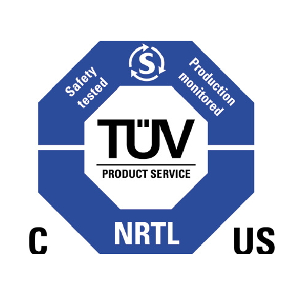
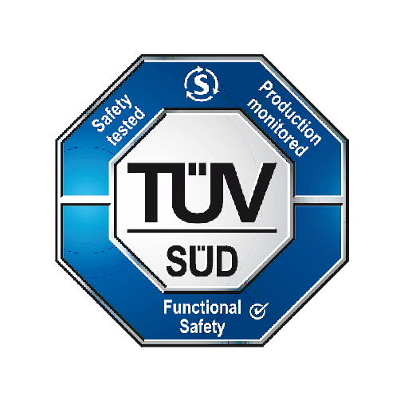
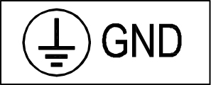

# 1.2.3 Safety labels

On the inside and outside of the controller, nameplates, warning signs, safety symbols, and the like are attached. Check the labels to ensure safety.

####  Caution for Power and Grounding

####  High voltage Indication

#### &#x20; Input power Indication

#### Air irculation of ventiduct&#xD; precautions

#### NRTL Certification mark

#### Nameplate

#### high voltage&#xD; Warning&#xD;

#### Installation precautions

#### Functional safety Certification mark

#### Ground wire connection precautions

#### Ground mark&#xD;


**\[Warning]** : Never engage in behaviors that damage safety labels, such as moving the position of the nameplate, warning signs, safety symbols, nomenclature markings, cable markings, and the like attached to the controller. In addition, do not hide these labels by putting paint or covers.



**\[Caution]** : Indicate the robot installation areas and hazard areas with distinct shapes, colors, or styles so that they are clearly distinguished from other facilities and equipment.

