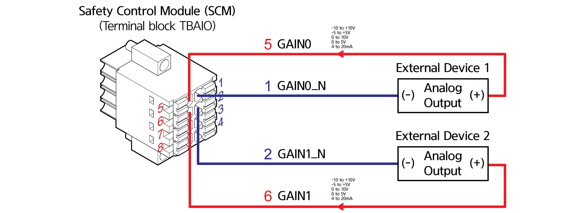

# 4.3.2.5 Connection of common digital I/O signals (TBAIO)

Common analog input signals are connected through TBAIO (two at the maximum). In the following example, External Device 1 is input to GAIN0, and External Device 2 is input to GAIN1.

Common analog output signals are connected through TBDIO (two at the maximum). In the following example, the load of External Device 1 is operated through the output to GAOUT0, and the load of External Device 2 is operated through the output to GAOUT1.

| **No** | **Name** | 　　　　　　　**Usage**                        |
| :----: | :------: | --------------------------------------- |
|    1   | GAIN0\_N | Ground of GAIN0 for common analog input |
|    2   | GAIN1\_N | Ground of GAIN1 for common analog input |
|    3   |  GND\_A  | Common analog GND                       |
|    4   |  GND\_A  | Common analog GND                       |
|    5   |   GAIN0  | Common analog input 0                   |
|    6   |   GAIN1  | Common analog input 1                   |
|    7   |  GAOUT0  | Common analog output 0                  |
|    8   |  GAOUT1  | Common analog output 1                  |
