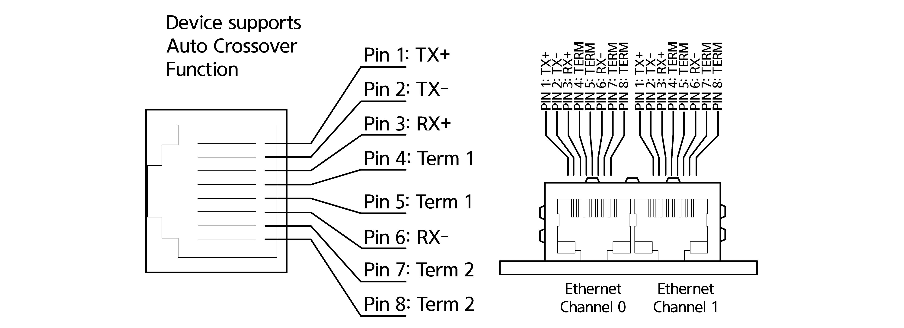

# 4.3.8.1 Connect pin map

　The pin composition of communication connectors varies depending on PCI communication cards.

| **No** | **Signal** | 　　　　**Description**                                                                                  |
| :----: | :--------: | ---------------------------------------------------------------------------------------------------- |
|    1   |     TX+    | Transmit data +                                                                                      |
|    2   |     TX-    | Transmit data -                                                                                      |
|    3   |     RX+    | Receive data +                                                                                       |
|    4   |    Term1   | 
Connected to each other and terminated to PE through RC circuit

(Bob Smith Termination)
 |
|    5   |    Term1   | 
Connected to each other and terminated to PE through RC circuit

(Bob Smith Termination)
 |
|    6   |     RX-    | Receive data -                                                                                       |
|    7   |    Term2   | 
Connected to each other and terminated to PE through RC circuit

(Bob Smith Termination)
 |
|    8   |    Term2   | 
Connected to each other and terminated to PE through RC circuit

(Bob Smith Termination)
 |

| **No** | **Signal** | 　　　　**Description** |
| :----: | :--------: | ------------------- |
|    1   |     DA     | Data A              |
|    2   |     DB     | Data B              |
|    3   |     DG     | Data Ground         |
|    4   |     SLD    | Shield              |
|    5   |     FG     | Field Ground        |

| **No** | **Signal** | 　　　　**Description**                          |
| :----: | :--------: | -------------------------------------------- |
|    1   |     V-     | Reference potential DeviceNet supply voltage |
|    2   |   CAN\_L   | CAN Low-Signal                               |
|    3   |    Drain   | Shield                                       |
|    4   |   CAN\_H   | CAN High-Signal                              |
|    5   |     V+     | +24 V DeviceNet supply voltage               |

| **No** | **Signal** | 　　　　**Description**                                |
| :----: | :--------: | -------------------------------------------------- |
|    3   |  RxD/TxD-P | Receive/Send Data-P respectively connection B plug |
|    5   |    DGND    | Reference potential                                |
|    6   |     VP     | Positive supply voltage                            |
|    8   |  RxD/TxD-N | Receive/Send Data-N respectively connection A plug |
