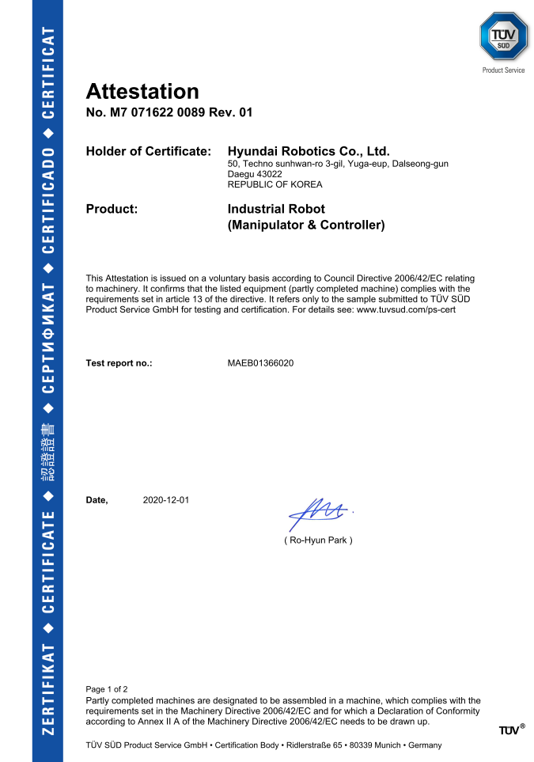
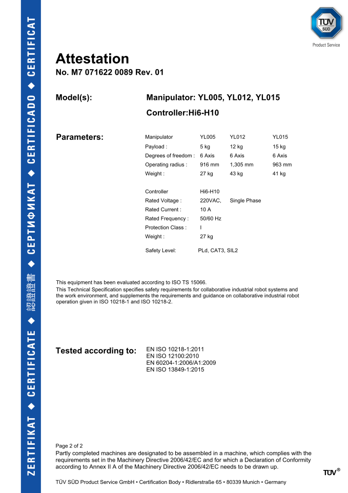
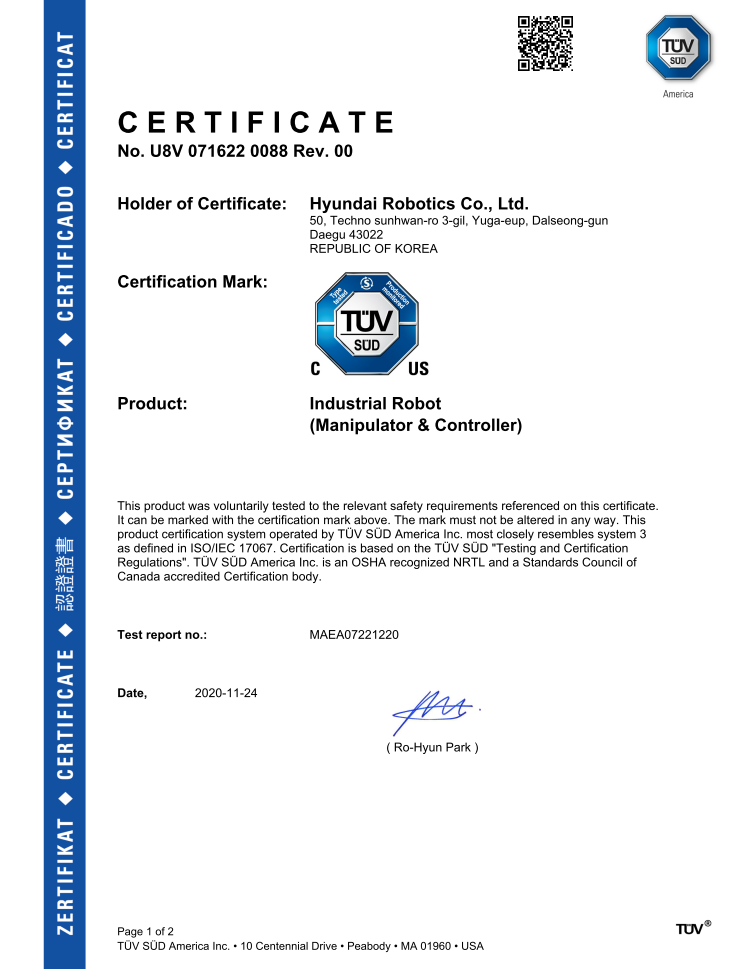
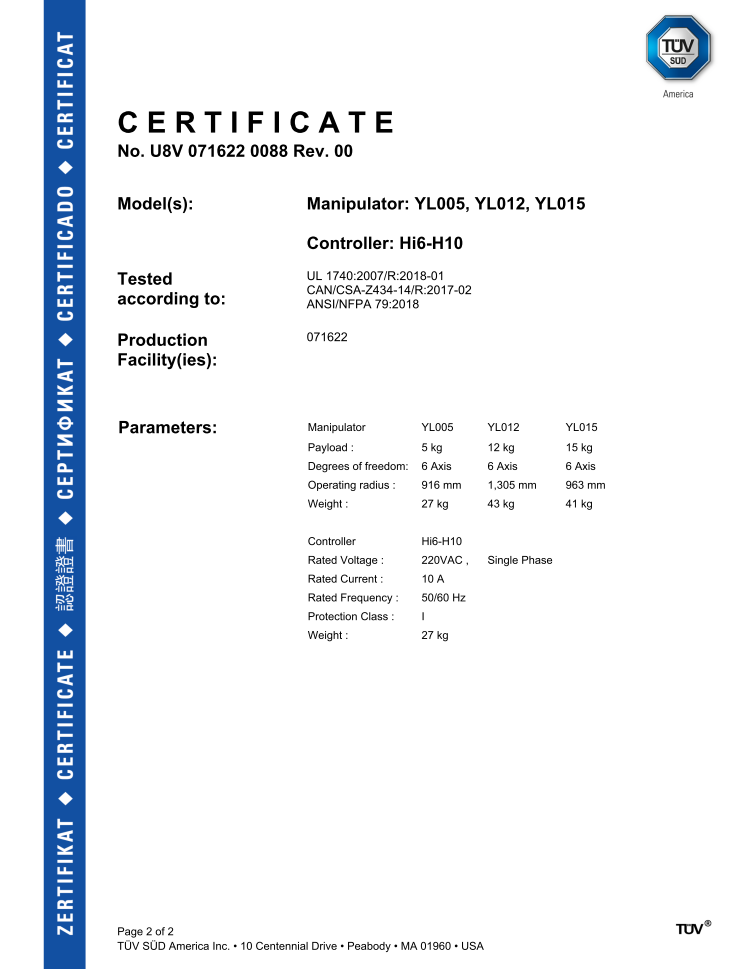
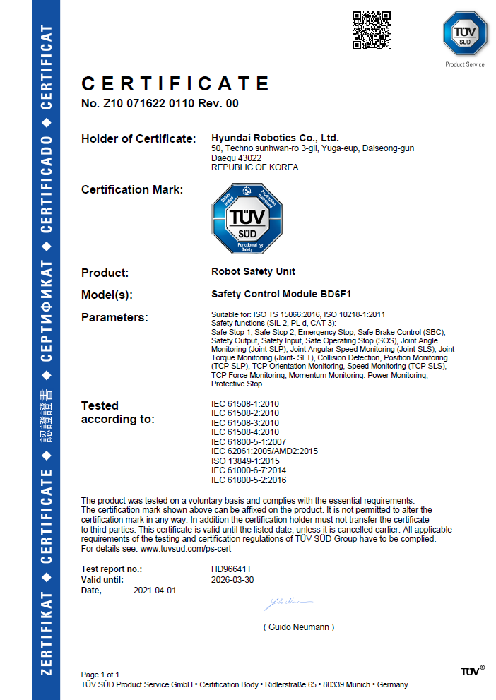
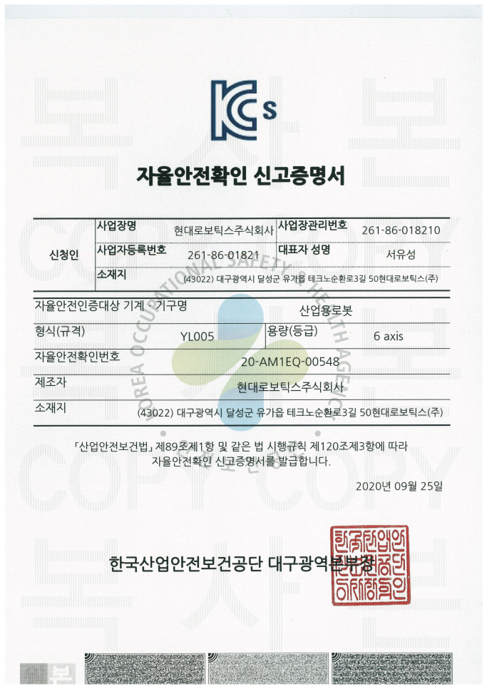
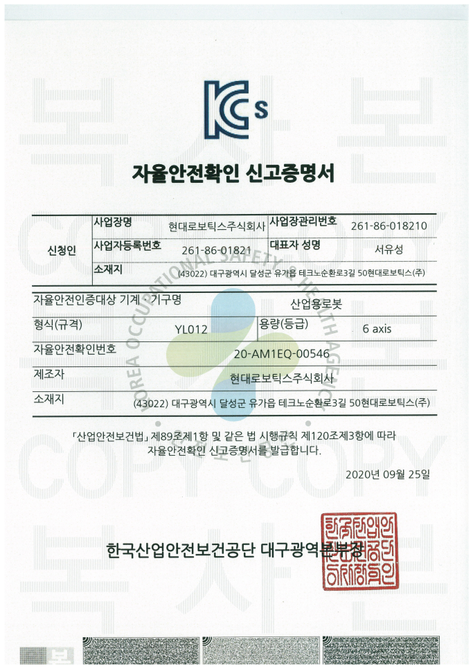
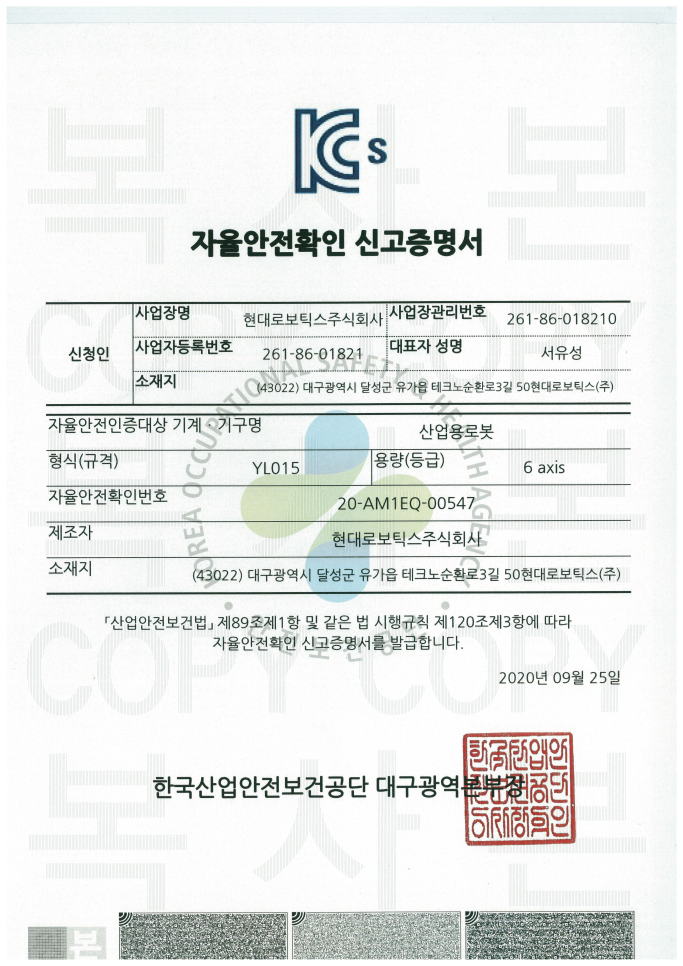

# 협동로봇 보수설명서


본 제품 설명서에서 제공되는 정보는 현대로보틱스의 자산입니다.

현대로보틱스의 서면에 의한 동의 없이 전부 또는 일부를 무단 전재 및 재배포할 수 없으며, 제3자에게 제공되거나 다른 목적에 사용할 수 없습니다.

본 설명서는 사전 예고 없이 변경될 수 있습니다.

**Copyright ⓒ 2020 by Hyundai Robotics Co., Ltd**

# 이 설명서에 대하여

이 설명서는 현대로보틱스 협동로봇의 안전, 설치, 사용 및 유지 보수 방법에 대해 설명합니다.

제품을 사용하기 전에 반드시 설명서의 내용을 충분히 숙지하시기 바랍니다. 또한 필요할 때 언제든 볼 수 있도록 설명서를 가까운 장소에 보관하십시오.

이 설명서는 현대로보틱스 제품을 구매한 고객에게 참조용으로 제공되거나 교육을 위한 내부 교육 자료로 제공되어 사용될 수 있습니다.

이 설명서는 표준 사양을 기준으로 작성되었으므로 구입하신 제품의 모델에 따라 일부 내용이 다를 수 있습니다. 또한 이 설명서의 내용과 사양은 제품의 성능 향상을 위해 예고 없이 변경될 수 있으며 부정확한 내용이나 오탈자로 인해 발생하는 상황에 대해서 현대로보틱스는 책임이 없습니다. 개정에 관한 상세한 정보는 당사의 인터넷 웹사이트([www.hyundai-robotics.com](https://www.hyundai-robotics.com))를 방문하여 확인하시기 바랍니다.

이 설명서가 적용되는 제품은 다음과 같습니다.

|     **항목**    |  **명칭** | **버전** |
| :-----------: | :-----: | :----: |
|               |  YL012  |   0D   |
|     로봇 기구     |  YL015  |   0B   |
|               |  YL005  |   0A   |
|      제어기      | Hi6-H10 |  V1.0  |
| 안전 제어 모듈(SCM) |  BD6F1  |  V1.2  |
|     티치 펜던트    |  TP600  |  V1.0  |
# 저작권

이 제품과 설명서에서 다루고 있는 모든 프로그램과 파일, 콘텐츠는 저작권 법과 비밀 유지 계약에 의하여 보호받고 있습니다. 현대로보틱스가 명시적으로 허용하지 않은 사용, 복사, 제 3자에의 공개 및 배포 등의 행위는 엄격히 금지됩니다.

Copyright ⓒ 2020 HYUNDAI ROBOTICS. All rights reserved.
# 표기규약

이 설명서에서는 내용의 이해를 돕기 위해 다음의 표기 규약과 안전 지시를 사용합니다.

### <mark style="color:green;">그림 설명</mark>

그림은 제품 조작 방법의 이해를 돕고 화면을 설명하는데 사용합니다. 그림을 설명할 때에는 다음과 같이 해당 부분에 숫자를 표기하고 그에 대응하는 내용을 설명합니다.

### <mark style="color:green;">GUI (Graphical User Interface)</mark>

GUI 는 메뉴 이름 및 버튼 이름을 대괄호\*\*(\[ ]\*\*) 안에 넣고 **굵은 글씨**로 표시합니다. 여러 메뉴를 순서대로 선택해야 할 때에는 이름 사이에 > 기호를 넣어 표시합니다.

* 이름이 있는 메뉴: 수동 또는 자동 모드의 초기 화면에서\*\* \[메뉴] \*\*버튼을 선택하십시오.
* 여러 메뉴: 수동 모드의 초기 화면에서 **\[설정]** 버튼 > **\[5: 초기화 > 7: 유닛 설정]** 메뉴를 선택하십시오.

### <mark style="color:green;">조작키 표기법</mark>

기능 조작을 위하여 티치 펜던트의 조작부에서 누르는 키는 홑화살괄호(**< >**)에 넣고 **굵은 글씨**로 표시합니다.

* **<시작>** 키를 누르면 로봇에 작성된 프로그램의 자동 운전을 시작합니다.

### <mark style="color:green;">상호 참조</mark>

설명서 내에서 연관된 정보로의 바로가기를 제공합니다. 상호 참조는 다음과 같이 **굵은 글씨**에 큰따옴표(“ ”)로 표시합니다.

* 날짜와 시간 정보 변경에 대한 자세한 내용은 Hi6 제어기 조작설명서의 “**4.5 날짜 및 시간 설정**”을 참조하십시오.

### <mark style="color:green;">참고 사항</mark>

제품을 사용할 때 알아 두면 좋을 유용한 사항이나 추가적인 정보를 다음과 같이 제공합니다.


상태표시줄에 아이콘이 깜빡이면 엔지니어모드 상태입니다.

# 안전 주의 사항

제품의 올바른 사용과 사용자의 안전을 확보하고 재산상의 피해 방지를 위해 반드시 다음의 안전 주의 사항을 숙지한 후 제품을 사용하시기 바랍니다.

### <mark style="color:green;">위험</mark>


**\[위험] 긴박한 위험**: 준수하지 않았을 경우 작업자가 사망하거나 중상을 입을 수 있습니다.


* 개별 장치가 아닌 전체 시스템을 대상으로 위험성 평가를 실시하십시오. 제품에 다른 장치를 연결하면 제품의 위험도가 높아지거나 새로운 위험이 발생할 수 있습니다. 로봇 통합 시스템의 각 장치의 위험도가 다를 경우에는 위험도가 가장 높은 장치를 기준으로 안전 장치를 마련하여 위험에 대비하십시오.
* 설명서에 기술된 제품 설치 내용을 숙지하고 지시 사항을 준수하여 로봇 제품과 기타 장치를 설치하십시오.
* 제품의 고장이나 파손 등 문제가 발생했을 경우 즉시 사용을 중단하고 고객지원팀에 문의하십시오.

### <mark style="color:green;">경고</mark>


**\[경고] 잠재적인 위험**: 준수하지 않았을 경우 작업자가 상해를 입거나 제품이 크게 손상되는 등 재산상의 손해를 입을 수 있습니다.


* 위험성 평가 결과에 따라 적절한 안전 조치를 취하고 로봇 안전 설치 범위를 정확히 지정하십시오. 로봇 동작 중 제품이 손상되거나 사용자가 상해를 입을 수 있습니다.
* 로봇 응용 시스템 제조자나 로봇 사용자는 설명서의 내용을 숙지하고 제품의 운영 교육을 이수하십시오.
* 작업자와 사용자의 안전을 위해 제품 설치 전 반드시 안전 펜스 등 적절한 안전 시설을 마련하십시오.
* 로봇 암이 자유롭게 움직일 수 있도록 충분한 공간을 확보하십시오. 설치 공간이 여유롭지 못하면 로봇 동작 중 제품이 손상되거나 사용자가 상해를 입을 수 있습니다.
* 규격 정보를 확인하여 알맞은 고정 나사를 사용하여 지정된 토크로 체결하십시오. 나사가 헐거우면 로봇이 설치 장소에서 분리되어 추락하거나 손상될 수 있습니다.
* 제품의 연결부(전원 및 케이블)에 액체나 먼지, 금속 가루 등의 전도성 이물질이 들어가지 않도록 주의하십시오. 또한 연결부를 뾰족한 물체로 찌르거나 케이블 연결 시 무리한 힘을 가하지 마십시오. 연결 단자의 부식 또는 일시적인 단락으로 제품이 폭발하거나 화재가 발생할 수 있습니다.
* 배선 정보를 확인하고 장치 유형에 맞춰 알맞은 단자를 이용해 장치를 연결하십시오. 특히, 안전 장치는 일반 단자에 연결하면 안전 기능을 보장할 수 없으므로 반드시 안전 장치용 단자에 연결하십시오.
* 손상된 케이블을 절대 사용하지 말고 제품 사용 중에는 전원을 분리하지 마십시오. 감전, 화재, 고장, 및 상해의 원인이 될 수 있습니다.
* 제품을 장시간 사용하면 열이 발생하여 화상 등 상해의 위험이 있습니다. 제품을 만져야 할 경우에는 전원을 끄고 1시간 이상 방치하여 제품을 충분히 냉각한 후 작업하십시오.
* 절대 무단으로 제품을 설치, 개조, 분해 및 수리하지 마십시오. 고장 및 사고의 원인이 될 수 있습니다. 또한 이로 인한 제품의 손상 및 파손에 대해 당사는 책임지지 않습니다.

### <mark style="color:green;">주의</mark>


**\[주의] 저위험 요소**: 준수하지 않았을 경우 작업자가 경미한 상해를 입거나 제품이 손상되는 등 재산상의 손해를 입을 수 있습니다.


* 제품을 임의로 설치 또는 개조, 분해, 수리하지 마십시오. 또한 당사의 전문가 이외의 사람이 임의로 제품을 개조하거나 부품을 부착하는 행위를 금합니다. 이로 인한 제품 고장 발생 시 무상 서비스 및 품질 보증 서비스를 받을 수 없습니다.
* 제품을 설치 및 수리할 때에는 고객지원팀에 문의하여 전문가에게 의뢰하십시오.
* 먼지가 많거나 더러운 곳에 제품을 설치 및 사용하지 마십시오. 먼지나 이물질로 인해 제품이 고장 나거나 성능에 이상이 발생할 수 있습니다.
* 자성이 있거나 자성의 영향이 미치는 곳 또는 전자파 장해가 있는 곳에 제품을 설치 및 사용하지 마십시오. 자성에 의해 제품이 손상되거나 성능에 이상이 발생할 수 있습니다.
* 제품 운전 시에는 헐거운 옷이나 장신구를 착용하지 말고, 머리카락이 긴 경우에는 뒤로 묶어 로봇의 관절 등에 끼이지 않도록 주의하십시오.
* 제품 동작 중에는 작동 범위 내에 들어가거나 로봇을 만지지 마십시오. 상해의 위험이 있습니다.
* 제품은 포장된 상태로 운반하여 파손을 피하고 습도가 낮은 건조한 장소에 보관하십시오. 포장 자재 내부에 습기로 제품이 손상되거나 고장 날 수 있습니다.
* 제품은 온도와 습도가 변하기 쉬운 곳을 피하고, 깨끗하고 서늘하며 건조한 곳에 보관하십시오.
* 제품 운반 시에는 올바 자세를 유지하고 두 명 이상이 함께 작업하십시오. 허리나 팔, 다리 등의 신체 부위에 상해를 입을 수 있습니다.
* 리프팅 장비를 이용해 제품을 운반하는 경우에는 해당 국가 및 지역의 안전 규정 및 장비 사용 지침을 준수하십시오.
* 설명서의 운반 내용을 숙지하고 지시 사항을 준수하여 제품을 운반하십시오. 고객의 제품 운송으로 발생한 제품의 손상 및 파손에 대해 당사는 책임지지 않습니다.
# 1. 안전

# 1.1 안전 요구 사항

# 1.1.1 적용 표준

이 제품은 산업용 로봇 안전 표준 ISO 10218-1 과 협동 운전에 관한 기술 사양서 ISO/TS 15066 에 따라 설계 및 제조되었습니다. 이 제품에 적용된 안전 표준은 다음 같습니다.

* ISO 10218-1:2011 Robots and robotic devices - Safety requirements for industrial robots - Part 1: Robots
* ISO 10218-2:2011 Robots and robotic devices - Safety requirements for industrial robots - Part 2: Robot systems and integration
* ISO/TS 15066:2016 Robots and robotic devices - Safety requirements - Industrial collaborative workspace
* IEC 61508-1:2010 Functional safety of electrical/electronic/programmable electronic safety-related systems - Part 1: General requirements
* IEC 61508-2:2010 Functional safety of electrical/electronic/programmable electronic safety-related systems - Part 2: Requirements for electrical/electronic/programmable electronic safety-related systems
* IEC 61508-3:2010 Functional safety of electrical/electronic/programmable electronic safety-related systems - Part 3: Software requirements
* IEC 61508-4:2010 Functional safety of electrical/electronic/programmable electronic safety-related systems - Part 4: Definitions and abbreviations
* IEC 61508-5:2010 Functional safety of electrical/electronic/programmable electronic safety-related systems - Part 5: Examples of methods for the determination of safety integrity levels
* IEC 61508-6:2010 Functional safety of electrical/electronic/programmable electronic safety-related systems - Part 6: Guidelines on the application of IEC 61508-2 and IEC 61508-3
* IEC 61508-7:2010 Functional safety of electrical/electronic/programmable electronic safety-related systems - Part 7: Overview of techniques and measures
* IEC 61800-5-1:2007/A1:2017 Adjustable speed electrical power drive systems - Part 5-1: Safety requirements - Electrical, thermal and energy
* IEC 61800-5-2:2015 Adjustable speed electrical power drive systems - Part 2: General requirements - Rating specifications for low voltage adjustable speed a.c. power drive systems
* ISO 13849-1:2015 Safety of machinery - Safety-related parts of control systems - Part 1: General principles for design
* ISO 13849-2:2012 Safety of machinery - Safety-related parts of control systems - Part 2: Validation
* IEC 62061:2005/A2:2015 Safety of machinery. Functional safety of safety-related electrical, electronic and programmable electronic control systems
* IEC 61784-3:2016 Industrial communication networks - Profiles - Part 3: Functional safety fieldbuses - General rules and profile definitions
* IEC 61800-3:2017 Adjustable speed electrical power drive systems - Part 3: EMC requirements and specific test methods
* IEC 61000-6-7:2014 Electromagnetic compatibility (EMC) - Part 6-7: Generic standards - Immunity requirements for equipment intended to perform functions in a safety-related system (functional safety) in industrial locations
* IEC 61326-3-1:2017 Electrical equipment for measurement, control and laboratory use. EMC requirements. Part 3-1: Immunity requirements for safety-related systems and for equipment intended to perform safety-related functions (functional safety) - General industrial applications
# 1.1.2 안전 성능

협동로봇의 안전 성능은 다음과 같습니다.

|            **항목**            | **안전 성능** |         **적용 표준**         |
| :--------------------------: | :-------: | :-----------------------: |
|              HFT             |     1     | IEC 61508/62061/61800-5-2 |
| SIL (Safety Integrity Level) |     2     | IEC 61508/62061/61800-5-2 |
|           Category           |     3     |        ISO 13849-1        |
|    PL (Performance Level)    |     d     |        ISO 13849-1        |
# 1.2 안전 대책

제품에 내장된 안전 기능과 사용자와 작업자의 안전을 확보하기 위한 대책에 대해 설명합니다.
# 1.2.1 안전 기능

협동로봇은 다음의 안전 기능을 기반으로 협동 작업을 수행하도록 되어 있습니다. 각 안전 기능에 대한 자세한 내용은 "[**협동로봇 안전 기능 설명서**](https://hyundai-robotics.gitbook.io/cobot-safety-function/)"를 참조하십시오.

* 안전 토크 정지(STO: Safe Torque Off)
* 안전 정지1 (SS1: Safe Stop 1)
* 안전 정지2 (SS2: Safe Stop 2)
* 비상 정지(EM Stop, Emergency Stop)
* 보호 정지(Protective Stop)
* 안전 브레이크 제어(SBC: Safe Brake Control)
* 안전 출력(Safety Outputs)
* 안전 입력(Safety Inputs)
* 안전 운전 정지(SOS: Safe Opertaing Stop)
* 조인트 각도 감시(Joint-SLP, Joint Angle Monitoring)
* 조인트 속도 감시(Joint-SLS, Joint Angular Speed Monitoring)
* 조인트 토크 감시(Joint- SLT, Joint Torque Monitoring)
* 충돌 검지(Collision Detection)
* TCP 위치 감시(TCP-SLP, TCP Position Monitoring)
* TCP 방향 감시(TCP Orientation Monitoring)
* TCP 속도 감시(TCP-SLS, TCP Speed Monitoring)
* TCP 힘 감시(TCP Force Monitoring)
* 모멘텀 감시(Momentum Monitoring)
* 파워 감시(Power Monitoring)
# 1.2.2 안전 교육

제품의 기능을 효과적으로 사용하려면 반드시 설명서의 내용을 숙지하고 제품을 올바르게 설치, 사용 및 보수해야 합니다. 제품 사용자는 로봇이 설치 및 사용되는 지역의 로봇 관련 안전 법규의 숙지 및 준수의 책임과 로봇 시스템에서 작업하는 사용자의 안전을 담보할 안전 장치를 제대로 설계, 설치 및 운용할 책임을 가집니다.

* 로봇 시스템의 설치, 사용 및 보수를 행하는 모든 작업자들은 반드시 설명서를 숙독하여 내용을 완전히 이해해야 합니다. 특히 안전 주의 사항(:warning:)을 반드시 숙지하기 바랍니다.
* 당사에서는 제품의 설치, 사용 및 보수 관련 교육을 계획하여 시행하고 있습니다. 제품 사용자 및 작업자는 반드시 해당 교육 과정을 이수한 후에 제품을 사용하십시오.
* 로봇의 티칭(teaching) 및 점검을 담당하는 작업자는 로봇 사용 전에 반드시 로봇 사용 및 안전 교육을 이수해야 합니다. 안전 교육 과정에서 다루는 내용은 다음과 같습니다.
  * 안전 개념 및 안전 장치의 목적과 기능
  * 로봇을 안전하게 다루는 절차
  * 로봇 및 로봇 시스템의 성능과 잠재적인 위험 요소
  * 특정 로봇의 응용 관련 작업 등
# 1.2.3 안전 레이블

제어기의 내외부에는 명판과 경고 표시, 안전 기호 등이 부착되어 있습니다. 부착된 레이블을 확인하여 안전을 확보하십시오.

####  전원 및 접지 연결 주의 사항

####  고전압 표시

####  입력 전원 표시

#### 공기 순환구 주의 사항

#### NRTL 인증 마크

#### 명판

#### 고전압 경고

#### 설치 주의 사항

#### 기능 안전 인증 마크

#### 접지선 연결 주의 사항

#### 접지 표시


**\[경고]** : 제어기에 부착된 명판, 경고 표시, 안전 기호, 명칭 표시, 전선 마크 등의 위치를 옮기거나 페인트칠 및 커버를 씌워 가리는 행위 등 안전 레이블에 손상을 주는 일체의 행위를 금합니다.



**\[주의]** : 로봇의 설치 영역 및 위험 지역은 형태나 색상, 스타일에서 차이를 두어 다른 시설 및 기기와 명확히 구분되도록 표시하십시오.

# 1.2.4 비상 정지

비상 정지 기능은 작업자 또는 다른 물체가 위험 지역에 진입하는 등 긴급 시나 비상 시에 작동합니다. 모든 비상 정지 스위치는 안전 영역 밖에서도 쉽게 접근할 수 있는 곳에 설치되어 있습니다.

비상 정지 기능이 실행되면 어떠한 경우에서도 로봇은 즉시 동작을 정지합니다.

* 로봇의 서보 시스템 전원이 차단되고 모터 브레이크가 동작합니다.
* 티치 펜던트(Teach pendant)의 화면에 비상 정지 메시지가 나타납니다.
# 1.2.4.1 비상 정지 스위치

비상 정지 스위치는 제어기와 티치 펜던트에 하나씩 설치되어 있습니다. 긴급 상황 발생 시 비상 정지 스위치를 누르십시오.

# 1.2.4.2 외부 시스템의 비상 정지 장치 연결

기본으로 설치되어 있는 비상 정지 스위치 외에 현장 환경 및 응용에 따라 추가로 외부 비상 정지 장치를 연결할 수 있습니다. 이에 대한 자세한 내용은 “[**3.3.2.4 D-SUB 25 커넥터(SDIO): 범용 안전 신호 입출력**](../../../3-product-install/3-3-robot-interface/2-external-device-interface/4-d-sub25-connector.md)”과 “[**4.3.2 안전 제어 모듈**](../../../4-maintenance/4-3-controller-check-maintenance/2-safety-control-module/)”을 참조하십시오.

# 1.3 위험성 평가

로봇을 포함한 통합 시스템 구성에 있어 위험성 평가는 대부분의 국가에서 법적 필수 사항으로 다루고 있을 만큼 중요한 요소 중 하나입니다. 로봇이 시스템에 통합되는 방식에 따라 로봇 설치에 대한 안전 평가가 달라지므로 로봇 자체만으로는 통합 시스템의 위험성을 평가할 수 없습니다.

시스템 관리자는 ISO 12100 및 ISO 10218-2의 지침에 따라 시스템을 구성하고 운영하여 위험성 평가를 진행해야 합니다. 또한 기술 규격서 ISO/TS 15066을 참고할 수 있습니다.

로봇을 포함한 통합 시스템의 전체 프로세스를 고려하여 위험성 평가를 진행하십시오. 위험성 평가의 주요 목표는 다음과 같습니다.

* 로봇 사용의 기본 설정 및 로봇 티칭
* 문제 진단 및 유지 보수
* 설치된 로봇의 정상 동작

로봇을 설치하고 시스템을 구성한 후에는 반드시 위험성 평가를 실행해야 합니다. 위험성 평가에서는 로봇 통합 시스템의 안전 장치의 적절성을 비롯하여 추가 비상 정지 장치 및 다른 안전 장치의 필요성 등을 주로 판단합니다.

적절한 안전 장치를 파악하여 로봇 통합 시스템을 올바르게 구성하는 것은 매우 중요합니다. 설명서 내에서 관련 내용을 참조하여 통합 시스템을 구성하십시오.

협동로봇은 TCP 속도, 압력, 파워, 모멘텀, 충돌 검지, 감속비의 제한치, 조인트별 각도, 속도, 토크 등의 제한치 등을 설정할 수 있습니다. 또한, 안전 관련 I/O를 이용하여 안전 기능을 구성할 수 있습니다. 안전 기능 구성에 대한 자세한 내용은 “[**협동로봇 안전 기능 설명서**](https://hyundai-robotics.gitbook.io/cobot-safety-function/)”를 참조하십시오.

**\[안전 기능]** 메뉴에서 협동로봇의 안전 관련 기능을 구성할 수 있으며 사용할 수 있는 기능은 다음과 같습니다.

* **포스 및 파워 제한**: 로봇과 작업자의 충돌을 대비하여 정지하는 힘과 압력을 제한
* **운동량 제한**: 로봇과 작업자의 충돌을 대비하여 로봇의 동작 속도를 줄여 에너지와 충격 하중을 제한
* **조인트 및 TCP 위치 제한**: 로봇이 사용자의 목이나 머리와 같은 특정 신체 부위로 이동하지 않도록 움직임을 제한
* **TCP 및 툴 자세 제한**: 툴과 작업 부품의 특정 영역이나 특징과 관련된 위험을 줄이기 위해 움직임을 제한(예: 툴 또는 작업물의 날카로운 부분이 작업자를 향해 이동하는 것을 막기 위함)
* **속도 제한**: 로봇과 작업자의 충돌을 대비하여 작업자가 충돌을 피할 시간을 제공하기 위해 로봇의 움직임이 저속으로 유지되도록 제한

이뿐만 아니라 로봇을 특정한 위치에 설치하거나 안전 I/O를 이용하여 안전 관련 기능을 구성할 수도 있습니다.

로봇 통합 시스템의 위험성 평가 시 중요 항목은 다음과 같습니다.

* 로봇별 충돌 심각도
* 로봇별 충돌 발생 가능성
* 로봇별 충돌 회피 가능성

통합 시스템 구성 시 로봇의 안전 관련 기능으로 위험 요소가 충분히 제거되지 않은 경우(예: 비협동로봇용 툴 사용 등)에는 위험성 평가를 통해 필요한 추가 보호 장치를 설치해야 합니다.
# 1.4 잠재적 위험

로봇과 연동된 통합 시스템의 위험성 평가에서 로봇의 안전 관련 기능만으로 위험 요소가 충분히 제거되지 않았다는 결과가 도출되었을 경우에는 반드시 추가 보호 대책을 수립해야 합니다.

추가 보호 대책 수립 시 고려해야 할 사항은 다음과 같습니다.

* 설치 시 로봇 베이스와 설치대 사이에 손가락 끼임(협착)
* 작업 영역 내의 장애물 및 툴의 날카로운 가장자리나 뾰족한 부분에 의한 상해(찔림, 관통 등)
* 로봇과의 충돌에 의한 상해(멍, 넘어짐, 골절 등)
* 로봇 주변의 장애물에 의한 상해(찔림, 관통, 골절 등)
* 체결 부위가 완전히 고정되지 않아 발생할 수 있는 상해
* 독성이 있는 물질 및 유해 물질 작업 시 발생할 수 있는 상해(피부 손상, 호흡 곤란 등)
* 갑작스러운 전원 중단으로 툴에서 작업물 이탈
* 다른 장비의 비상 정지 스위치와 혼동하여 발생하는 실수
* 안전 관련 기능 설정의 임의 변경에 의한 오류 등

발생 가능한 위험의 유형은 시스템 구성에 따라 다르므로 통합 시스템을 사용하기 전에는 반드시 위험성 평가를 실행하십시오.
# 1.5 유효성 및 책임

로봇을 설치 및 사용하는 국가 및 지역의 안전 규정 및 법률을 기준으로 안전 요건을 준수해야 합니다. 로봇 통합 시스템의 공급자와 사용자에게는 다음의 사항을 비롯하여 다양한 책임이 부여됩니다.

* 로봇 통합 시스템의 위험성 평가
* 위험성 평가 결과에 따른 안전 장치의 추가 및 제거
* 통합 시스템의 올바른 구성, 설치 및 설정 여부 확인
* 통합 시스템의 사용 방법과 지침 구축 및 사용자 교육
* 안전 장치 관리(사용자의 안전 장치 임의 변경 및 조작 금지)
* 제품 사용 및 안전에 관한 중요 정보 및 연락처 등의 정보 제공
* 설명서를 비롯한 모든 종류의 기술 문서 제공 등

이 설명서의 안전 관련 내용에서 제품 사용 중 발생할 수 있는 모든 위험 요소와 상황을 다루지는 않습니다.
# 2. 제품 소개

이 제품은 다양한 툴을 이용하여 물체를 운반하거나 부품을 조립하는데 사용할 수 있는 산업용 협동로봇으로 설명서에 명시된 조건을 만족하는 환경에서만 사용할 수 있습니다. 이 제품에는 사람과의 협업을 목적으로 제작되어 물리적인 보호 기구 없이도 사람과의 협동을 가능하게 하는 안전 기능이 탑재되어 있습니다.


**\[주의]**: 툴, 작업 대상물, 기타 추가 장비 등과 연동된 시스템을 구성할 경우에는 반드시 최종 위험성 평가를 수행하여 안정성이 입증된 후 사용하십시오.

# 2.1 제품 용도

이 제품은 제품에 지정된 본래의 용도로만 사용할 수 있습니다. 본래 용도 이외의 다른 용도로 제품을 사용하는 것은 용도의 범위를 벗어나는 것으로 부적절한 행위로 간주됩니다. 이로 인해 발생하는 상해와 제품 손상 및 고장 등의 재산상의 손해는 현대로보틱스에서 책임지지 않습니다. 부적절한 사용의 예는 다음과 같습니다.

* 밟고 올라서기 위한 용도로 제품 사용
* 사람 및 동물의 이송에 제품 사용
* 의료 및 인명과 관련된 분야에서의 제품 사용
* 폭발 위험이 있는 환경에서의 제품 사용
* 위험성 평가 없이 제품 사용
* 안전 기능의 성능이 충족되지 않은 상태에서의 제품 사용
* 성능 및 환경 조건이 충족되지 않은 곳에서의 제품 사용
* 국제 표준(IEC)보다 높은 수치의 전자기파가 방사되는 곳에서의 제품 사용(용접 등)
# 2.2 제품 구성


* 협동로봇 모델에는 YL005와 YL012, YL015가 있습니다. 이 보수 설명서에서는 YL012 모델을 기준으로 구성과 설치, 사용 및 보수 방법을 설명합니다.
* 협동로봇의 모델에 따라 구성품과 제품 각 부분을 비롯하여 사용 방법 등 일부 내용이 다를 수 있습니다.
* 제품의 포장재를 폐기하지 말고 보관해 두면 제품의 보관 및 운반에 이용할 수 있습니다.

# 2.3 각부 명칭

제품 각 부분의 이름을 알아 두면 제품 설치 및 사용 방법을 확인할 때 유용합니다.
# 2.3.1 로봇 기구

|                                                                                                                  **번호**                                                                                                                  |    **이름**   | 　　　　　**설명**                                                                                                                                                   |
| :--------------------------------------------------------------------------------------------------------------------------------------------------------------------------------------------------------------------------------------: | :---------: | ------------------------------------------------------------------------------------------------------------------------------------------------------------- |
|                                                                                                                                                                                                          | 전원 및 통신 커넥터 | 로봇에 전원을 공급하고 로봇과 통신합니다.                                                                                                                                       |
|                                                                                                                                                                                                          |    에어 인렛    | 공압 호스를 연결하여 공압을 공급합니다.                                                                                                                                        |
|                                                                                                                                                                                                          |    툴 플랜지    | 로봇에 툴을 장착합니다.                                                                                                                                                 |
|                                                                                                                                                                                                          |    에어 아웃렛   | (YL012, YL015) 공압 호스(ø3.2, 2개)를 연결하여 다양한 툴의 움직임에 사용합니다.                                                                                                       |
|                                                                                                                                                                                                          |  툴 I/O 커넥터  | 툴의 동작을 제어합니다. 툴 I/O에 대한 자세한 정보는 “[**3.3.1 툴 플랜지 연결부**](../../3-product-install/3-3-robot-interface/1-tool-flange-connection-point/)”를 참조하십시오.                 |
|                                                                                                                                                                                                          |   핸드그립 모듈   | 직접 교시에 사용합니다.                                                                                                                                                 |
|                                                                                                                                                                                                          |   이더캣 커넥터   | 이더캣(EtherCAT) 기반의 단자로 툴과 통신합니다. 이더캣에 대한 자세한 정보는 “[**3.3.1 툴 플랜지 연결부**](../../3-product-install/3-3-robot-interface/1-tool-flange-connection-point/)”를 참조하십시오. |
|                                                                                                                                                                                                          |    LED 램프   | 로봇의 동작 상태를 표시합니다.                                                                                                                                             |
| <ul><li><strong>OFF</strong>: 로봇 시스템의 전원이 꺼져 있습니다.</li><li>
<strong>ON</strong>: 로봇 시스템의 전원이 켜져 있습니다. LED 램프의 색에 따른 로봇의 상태는 다음과 같습니다.
<ul><li><strong>흰색</strong>: 서보 활성화 대기(전원이 켜져 있거나 브레이크 적용) 또는 일반정지 상태입니다.</li></ul></li></ul> |             |                                                                                                                                                               |
|                                                                    <ul><li><strong>초록색</strong>: 서보 활성화(전원이 켜져 있거나 브레이크 풀림) 상태 입니다. 조그, 스텝 전후진 및 재생할 수 있습니다.</li></ul>                                                                   |             |                                                                                                                                                               |
|                                                                              <ul><li><strong>파란색</strong>: 직접 교시 모드에서 서보 활성화 상태입니다. 직접 교시만 가능합니다.</li></ul>                                                                              |             |                                                                                                                                                               |
|                                                                         <ul><li><strong>빨간색</strong>: 에러가 발생하여 로봇이 정지된 상태입니다. 문제를 해결하고 서보 활성화를 시도하십시오.</li></ul>                                                                         |             |                                                                                                                                                               |


* 에어 아웃렛은 YL012와 YL015 모델에만 지원됩니다.
* LED 램프는 모델에 따라 장착된 위치가 다릅니다. YL005와 YL015 모델의 경우 Upper frame cover에 LED 램프가 있습니다.
* 이더넷 옵션일 경우, 에어 대신 이더넷 커넥터가 설치됩니다.

# 2.3.2 제어기

|               **번호**              |   **이름**   | 　　　　　\*\*설명 \*\*                         |
| :-------------------------------: | :--------: | ---------------------------------------- |
|   | 로봇 케이블 커넥터 | 통신선과 전원선이 내장되어 제어기를 기구와 연결하는 커넥터입니다.     |
|   |   전원 커넥터   | 제어기에 전원을 공급하는 커넥터입니다.                    |
|   |   전원 차단기   | 전원 스위치를 이용해 제어기의 주전원을 켜거나 끕니다.           |
|   |     환풍구    | 제어기의 냉각을 위한 공기 유입 통로입니다.                 |
|   |     손잡이    | 제어기의 전면과 후면에 장착되어 운반에 사용합니다.             |
|   |  비상 정지 스위치 | 긴급 상황 발생 시 비상 정지 스위치를 눌러 로봇의 동작을 정지시킵니다. |
|   |  응용 장치 연결구 | 응용 장치를 내부의 모듈과 케이블로 연결할 경우 사용하는 통로입니다.   |
|   | 티치 펜던트 연결구 | 직결형의 티치 펜던트를 연결하는 통로입니다.                 |
|   |  I/O 연결 블록 | 주변 기기를 제어기에 연결합니다.                       |
|  |     도어     | 도어를 열어 제어기의 측면을 개방합니다.                   |
|  |     냉각     | 제어기 내부의 가열된 공기를 외부로 강제 유출시키는 장치입니다.      |
# 2.3.3 티치 펜던트

|                                          **번호**                                         |   **이름**   | 　　　　　**설명**                              |
| :-------------------------------------------------------------------------------------: | :--------: | ---------------------------------------- |
|                                                         |     조작키    | 로봇의 동작을 제어하고 명령을 입력하거나 메뉴를 선택하고 설정합니다.   |
|                                                         |    디스플레이   | 로봇의 동작 상태와 설정 정보를 확인 및 변경합니다.            |
|                                                         |   모드 스위치   | 모드 스위치를 돌려 운전 모드(자동, 수동, 원격)를 선택합니다.     |
|                                                         |  비상 정지 스위치 | 긴급 상황 발생 시 비상 정지 스위치를 눌러 로봇의 동작을 정지시킵니다. |
|                                                         |   조그 다이얼   | 조그 다이얼을 돌려 메뉴를 설정합니다.                    |
|                                                         |   마운팅 브래킷  | 티치 펜던트를 들거나 걸어 보관합니다.                    |
|                                                         |  인에이블링 스위치 | 수동 모드에서 티치 펜던트로 로봇 조작 시, 안전 스위치로 사용합니다.  |
| <ul><li><strong>1단, 3단</strong>: 로봇 운전이 정지됩니다. 3단일 경우, 2단을 거치지 않고 1단으로 복귀합니다.</li></ul> |            |                                          |
|                  <ul><li><strong>2단</strong>: 로봇을 조작할 수 있습니다.</li></ul>                 |            |                                          |
|                                                         | 케이블 연결 커넥터 | 제어기와 연결하기 위한 케이블을 연결하는 커넥터입니다.           |
|                                                         |  USB 연결 포트 | 이동식 저장 장치 등 USB 통신으로 접속 가능한 장치를 연결합니다.   |
# 2.4 명판

제품에 부착된 명판에는 로봇 형태, 제조 번호, 제조 일자 등의 정보가 기재되어 있습니다. 구입한 제품의 사양 정보가 일치하는지 확인하십시오.

현대로보틱스의 협동로봇 기구와 제어기의 모델명 표기 형식은 다음과 같습니다.

# 3. 제품 설치

설치 위치나 방향, 주위 공간의 크기 등을 고려하여 제품을 올바르게 설치하면 제품의 수명을 확보하고 성능 저하를 방지할 수 있습니다. 협동로봇의 설치 순서는 다음과 같습니다.

1. 설치 및 사용 환경 확인
2. 로봇의 작업 영역 확인
3. 로봇의 손목축 부하 허용치 및 가반하중 확인
4. 로봇 시스템 구성 및 설치
5. 툴 연결
6. 외부 장치 및 안전 장치 연결
7. 로봇의 작업 영역 설정: 안전 정격 연성 축 및 공간 제한 기능, 정지 거리 및 정지 시간 적용
8. 안전 기능 설정
9. 로봇 시운전: 설정 및 안전 기능의 정상 동작 확인


**\[주의]**

* 제품 설치 전에 반드시 충분한 위험성 평가를 수행하고 평과의 결과를 바탕으로 안전 기능을 설정하십시오.
* 안전 기능에 대한 자세한 내용은 “[**협동로봇 안전 기능 설명서**](https://hyundai-robotics.gitbook.io/cobot-safety-function/)”를 참조하십시오.

# 3.1 설치 환경 및 준비

# 3.1.1 설치 및 사용 환경

설치 및 사용 환경 조건을 고려하여 알맞은 장소에 제품을 설치합니다.

* 제품의 적정 사용 온도는 0℃ \~ 45℃이고, 적정 보관 습도는 20 \~ 85%RH입니다.
* 제품을 옮기거나 사용할 때에는 떨어뜨리는 등 강한 충격을 주지 마십시오.
* 제품의 무게에 따라 올바른 방법으로 안전에 유의하여 제품을 운반 및 설치하십시오.
* 제품이 쉽게 전복되지 않는 단단하고 평평한 곳, 진동이 없는 곳에 제품을 설치하고 사용하십시오.
* 물이나 습기, 가스, 먼지 등의 이물질이 많거나 더러운 곳에 제품을 설치 및 사용하지 마십시오.
* 인화성 및 부식성 물질이나 가스가 있는 곳, 열이 발생하는 곳 또는 화기 주변에 제품을 설치 및 사용하지 마십시오.
* 강한 전기적 노이즈 발생원이 있거나 그 영향이 미치는 곳에 제품을 설치 및 사용하지 마십시오.


**\[주의]**: 권장하는 장소에 제품을 설치하지 않을 경우 제품의 성능 및 수명이 감소될 수 있습니다. 권장 사항을 준수하여 제품을 설치 및 사용하십시오.

# 3.1.2 로봇 시스템 영역

로봇 시스템의 영역은 여러 단계가 있으며 협동로봇이 움직일 수 있는 최대 작업 영역은 모델별로 다릅니다. 다음 정보를 확인하고 운전 목적과 모델별 최대 작업 영역에 따라 알맞게 영역을 구성하십시오.

로봇 시스템과 작업자가 접촉하여 수행하는 협동운전에서 작업자는 안전 영역 내에서 작업합니다. 반면 로봇과 작업자의 접촉이 허가되지 않는 협동운전의 경우, 작업자는 보호 영역 내에서만 작업할 수 있습니다. 일반적인 산업용 로봇을 운전하는 경우에는 작업자는 보호 영역 밖에서 작업해야 합니다.

* **운전 영역(Operating space)**: 작업 프로그램에 따라 로봇이 움직이는 동안 사용되는 제한 영역의 한 영역
* **제한 영역(Restricted space)**: 제한 장치에 의해 제한되는 최대 영역의 한 영역
* **보호 영역(Safeguarded space)**: 보호 장치가 작동되는 영역
* **최대 영역(Maximum space)**: 로봇이 움직이는 영역으로 다다를 수 있는 영역

협동로봇이 움직일 수 있는 최대 작업 영역은 모델별로 다릅니다. 모델별 최대 작업 영역은 다음과 같습니다.


작업영역 내에서도 모든 자세가 가능한 것은 아니므로 HRSpace를 통해 확인하는 것을 권장합니다.


### <mark style="color:green;">YL005: 916 mm</mark>

### <mark style="color:green;">YL012: 1,305 mm</mark>

### <mark style="color:green;">YL015: 963 mm</mark>


상기의 S축을 관통하는 원통형 영역은 툴 플랜지는 느리게 움직이더라도 다른 관절들이 빠르게 움직여 비효율적 작동 및 로봇 손상을 유발할 수 있습니다. 따라서 이 영역에서 작동하는 것을 권장하지 않습니다.

# 3.1.3 손목축 부하 허용치

협동로봇의 손목축 선단에 부착될 부하는 허용 중량, 허용 부하 토크, 허용 관성 모멘트에 의해 규제됩니다. 모델별 손목축 부하 허용치는 다음과 같습니다.

# 3.1.4 가반하중

협동로봇의 최대 가반하중은 무게 중심과의 거리에 따라 다릅니다. 모델에 따른 영역별 최대 가반하중은 다음과 같습니다.

### <mark style="color:green;">YL005</mark>

### <mark style="color:green;">YL012</mark>

### <mark style="color:green;">YL015</mark>

# 3.2 제품 설치

자격이 있는 설치 전문가가 해당 국가 및 지역의 관련 규정 및 법규를 준수하여 제품을 설치해야 합니다.

* 포장 해체 시, 운반이나 해체 과정에서 발생할 수 있는 제품의 손상 여부를 확인하십시오.
* 포장 해체 후 제품을 설치하기 전에는, 반드시 안전 규정과 지시 사항, 제품의 설치 및 사용 환경 정보를 확인하고 설치 방법을 숙지하십시오.


**\[주의]**

* ISO 10218-2의 지침에 따라 로봇을 설치하고 운영해야 하며 ISO/TS 15066와 같은 국제 표준 및 국내 법규의 관련 요건을 준수해야 합니다.
* 국제 표준 및 국내 법규의 관련 요건을 준수하지 않거나, “**위험성 평가**”를 검토하지 않은 경우에 발생하는 사고에 대해서는 당사(또는 제조사)에서 책임지지 않습니다.

# 3.2.1 로봇 시스템 구성

협동로봇은 주변 장비와 연동된 통합 시스템으로 알맞은 주변 장치를 선택하여 시스템을 구성하고 연결합니다.

* **티치 펜던트**: 로봇 시스템 전체를 관리하기 위하여 명령을 입력하거나 상태를 확인할 수 있는 입출력 장치입니다. 로봇에게 특정 자세를 학습시키거나 프로그램을 설정 및 제어할 수 있습니다.
* **제어기**: 티치 펜던트로 설정한 프로그램의 설정값에 따라 로봇의 동작을 조정합니다. 제어기의 입출력 포트를 이용해 다양한 외부 장비 또는 장치와 연동하여 시스템을 구성할 수 있습니다.
* **로봇 기구**: 다양한 툴을 부착하여 물체를 운반하거나 부품을 조립하는데 사용하는 협동 운전 전용 머니퓰레이터입니다.
# 3.2.2 로봇 및 제어기 설치

1\. 협동로봇을 설치할 위치의 설치면의 콘크리트 두께를 확인하십시오. 콘크리트 두께에 따라 시공 준비를 해야 합니다.

* 두께가 200 ㎜ 이상인 경우, “[**3.2.2.1 마운팅 플레이트 설치**](1-mounting-plate-install.md)”를 참조하여 로봇을 설치할 위치에 마운팅 플레이트를 고정하십시오.
* 두께가 200 ㎜ 이하인 경우에는 고객지원팀에 문의하여 별도의 기초 공사를 진행하십시오.

2\. 협동로봇을 설치할 위치에 올려 놓으십시오.


**\[경고]**: 협동로봇은 독립적으로 설 수 없으므로 설치 시에는 2인 이상의 작업자가 함께 작업하십시오. 한 작업자가 로봇이 넘어지지 않도록 잡은 상태에서 다른 작업자가 고정할 수 있습니다.


3\. 육각 렌치 볼트(M8 (12.9), 4개)를 이용하여 협동로봇을 고정하십시오.

* 볼트의 적정 체결 토크는 340 kgf cm입니다.
* 위치 결정 핀(Ф6, 2개)을 이용하면 협동로봇을 특정 위치에 정확하게 설치할 수 있습니다.
* 접지선을 연결하면 정전기 발생을 방지할 수 있습니다.
* YL005와 YL015의 설치 위치 정보는 YL012와 동일합니다.


**\[경고]**: 로봇 동작 중 볼트가 풀리지 않도록 단단히 죄어 고정하십시오.


4\. 로봇 베이스가 설치면에 완전히 밀착되었는지 확인하십시오.

5\. 협동로봇의 설치 공간을 확인하고 적절한 곳에 로봇 제어기를 놓아 두십시오.


**\[주의]**

* 서늘하고 건조한 곳에 제어기를 위치하고 습기에 노출되거나 물에 젖지 않도록 주의하십시오.
* 공기가 순환할 수 있도록 제어기 주변에 충분한 여유 공간을 확보하십시오. 또한 제어기 앞면과 뒷면의 환풍구와 냉각팬을 막는 장애물이 없어야 합니다.

# 3.2.2.1 마운팅 플레이트 설치

협동로봇을 설치할 바닥의 강성은 로봇의 동적 영향을 최소화할 수 있도록 설계해야 합니다. 만약 설치면의 강성이 로봇 암을 지지하기에 부족하다면, 마운팅 플레이트(Mounting plate)를 이용하여 제품을 설치할 수 있습니다.


**\[경고]**: 로봇의 설치면은 로봇 자체의 무게와 로봇 동작 시 발생하는 하중을 모두 견딜 만큼 견고해야 합니다.


1. 협동로봇을 설치할 위치의 면을 확인하고 요철이나 균열 등을 보수하십시오.
2. 협동로봇을 설치할 위치에 마운팅 플레이트를 올려 놓으십시오.
3. 마운팅 플레이트 상부 접촉면의 볼트 구멍에 앵커 볼트(M20)를 끼운 후 적정한 토크로 죄거나 망치로 두드려 고정하십시오. 앵커 볼트는 마운팅 플레이트의 접촉면에서 최대 0.2 ㎜ (±0.1 ㎜) 돌출되어 있어야 합니다.

* 나머지 부분의 평면도는 ±0.2 ㎜ 내이어야 합니다.
* 마운팅 플레이트 4 매의 평면도는 0.2 ㎜ 이내로 하여 주십시오.
* 마운팅 플레이트 접촉면 4군데 평면도는 0.2 ㎜ (±0.1 ㎜) 이내로 하여 주십시오.
* 필요한 경우 심(Shim)을 이용하여 틈을 조정할 수 있습니다.
# 3.2.3 툴 연결

협동로봇에 원하는 툴을 결합합니다.

1\. 협동로봇 툴 플랜지의 연결부를 확인하십시오.

2\. 협동로봇의 툴 플랜지에 툴을 끼운 후 육각 렌치 볼트(M6 (12.9), 4개)와 핀(ø6)을 이용하여 툴을 툴 플랜지에 고정하십시오.

* 볼트의 적정 체결 토크는 127 kgf cm입니다.

3\. 툴 플랜지의 연결 단자에 툴 I/O 케이블과 이더캣 케이블을 연결하십시오.

* 공압 라인을 사용하려면, 원터치 피팅(M5)을 조립한 후 호스(Ф3.2, 2개)를 에어 아웃렛에 연결하십시오.


* 사용하는 툴에 따라 로봇에 결합하는 방법이 다를 수 있습니다. 툴 결합 방법에 대한 자세한 내용은 각 툴의 설명서를 찹조하십시오.
* 툴 I/O와 이더캣의 핀맵은 “[**3.3.1 툴 플랜지 연결부**](../3-3-robot-interface/1-tool-flange-connection-point/)”를 참조하십시오.

# 3.2.4 배선

협동로봇과 제어기의 연결부를 확인하고 알맞은 케이블을 연결합니다.

1\. 로봇 연결 케이블을 협동로봇 베이스의 연결 단자에 끼운 후 케이블이 빠지지 않도록 고정용 고리로 고정하십시오.

2\. 로봇 연결 케이블의 반대쪽 끝을 제어기 정면의 연결 단자에 끼운 후 케이블이 빠지지 않도록 고정용 고리로 고정하십시오.

3\. 전원 연결용 커넥터 핀 맵을 확인하고 전원 연결용 커넥터를 전원 케이블의 한쪽 끝에 연결하십시오.

|              **번호**              | **이름** |                 **설명**                 | **사양** |
| :------------------------------: | :----: | :------------------------------------: | :----: |
|  |    R   |                AC220V L상               | 16 AWG |
|  |   (R)  | 
AC220V L상 부가

(전원 증설 시 연결)
 | 16 AWG |
|  |   (T)  | 
AC220V T상 부가

(전원 증설 시 연결)
 | 16 AWG |
|  |    T   |                AC220V T상               | 16 AWG |
|  |   FG   |     
접지

(Frame ground)
     | 16 AWG |

4\. 전원 연결용 커넥터를 제어기 정면의 전원 커넥터에 끼운 후 케이블이 빠지지 않도록 고정용 고리로 고정하십시오.

5\. 전원 케이블 반대쪽 끝을 전원에 연결하십시오.


**\[주의]**

* 모든 유형의 배선, 단자 및 전기 관련 작업을 수행하기 전에는 반드시 제품의 전원을 차단하십시오.
* 케이블 커넥터의 모양을 확인하여 알맞은 단자에 연결하고 무리한 힘을 가하지 마십시오. 핀이 휘거나 손상될 수 있습니다.
* 케이블을 임의로 개조하거나 연장하지 마십시오.
* 당사에서는 고객 부주의, 조작 미숙 및 과실로 인한 제품의 손상 및 파손에 대해 책임지지 않습니다. 절대 무단으로 제품을 개조, 분해 및 수리하지 마십시오.

# 3.2.5 전원 켜기

협동로봇의 전원은 제어기의 전원 커넥터를 통해 공급됩니다.

전원 차단기의 스위치를 밀어 올리십시오. 전원이 연결되면 로봇 시스템이 부팅되어 티치 펜던트의 디스플레이가 켜지고 협동로봇 LED 램프가 흰색으로 켜집니다.

# 3.3 로봇 인터페이스

다음 주의 사항을 확인하여 툴 및 외부 장치를 연결하십시오.

* 모든 유형의 배선, 단자 및 전기 관련 작업을 수행하기 전에는 반드시 제품의 전원을 차단하십시오.
* 케이블 커넥터의 모양을 확인하여 알맞은 단자에 연결하고 무리한 힘을 가하지 마십시오. 핀이 휘거나 손상될 수 있습니다.
* 케이블을 임의로 개조하거나 연장하지 마십시오.
* 에어호스의 허용 온도 및 압력을 확인하여 사용하십시오.

당사에서는 고객 부주의, 조작 미숙 및 과실로 인한 제품의 손상 및 파손에 대해 책임지지 않습니다. 절대 무단으로 제품을 개조, 분해 및 수리하지 마십시오.
# 3.3.1 툴 플랜지 연결부

협동로봇 선단 툴 플랜지의 연결 단자를 이용하여 툴을 연결합니다.

|                **번호**               | 　　　　　　　　　　　**설명**                                        |
| :---------------------------------: | -------------------------------------------------------- |
|  | 이더캣 연결 단자(T4071017041-001 (TE)): 이더캣 통신                  |
|  | 툴 I/O 연결 단자(T41171130012-001 (TE)): 툴 동작 제어              |
|  | 에어 아웃렛 (YL012, YL015) : 공압 호스(ø3.2, 2개)를 연결하여 톨의 움직임에 사용 |
# 3.3.1.1 T4071017041-001 (TE) 핀 맵

| **번호** | **설명** | **번호** | **설명** |
| :----: | :----: | :----: | :----: |
|    1   |  TX +  |    3   |  RX +  |
|    2   |  TX -  |    4   |  RX -  |
# 3.3.1.2 T41171130012-001 (TE) 핀 맵

| **번호** |   **설명**   |   **번호**   |    **설명**   |
| :----: | :--------: | :--------: | :---------: |
|    1   | 디지털 출력 CH0 |            |             |
|        |            |            |             |
|        |      7     | 디지털 입력 CH2 |             |
|    2   | 디지털 출력 CH1 |      8     |  디지털 입력 CH3 |
|    3   | 디지털 출력 CH2 |      9     | 아날로그 입력 CH0 |
|    4   | 디지털 출력 CH3 |     10     | 아날로그 입력 CH1 |
|    5   | 디지털 입력 CH0 |     11     |    전압 출력    |
|    6   | 디지털 입력 CH1 |     12     |     GND     |
# 3.3.1.3 에어 호스

# 3.3.2 외부 장치 인터페이스

제어기 정면의 외부 장치 인터페이스를 이용하여 다양한 외부 장치를 연결할 수 있습니다.

|                            **번호**                           | 　　　　　　　　　　　**설명** |
| :---------------------------------------------------------: | ----------------- |
|                          | LAN 연결 포트         |
|                          | USB 연결 포          |
|                          | D-SUB 커넥터         |
| <ul><li>9 핀(COM1, COM2): 직렬 통신(RS485, 422, RS232)</li></ul> |                   |
|          <ul><li>25 핀(SDIO): 범용 안전 신호 입출력</li></ul>         |                   |
|                          | 터미널 블록            |
|              <ul><li>TB1: 범용 아날로그 입출력</li></ul>             |                   |
|              <ul><li>TB2: 전용 안전 신호 입력</li></ul>             |                   |
|             <ul><li>TB3: 범용 디지털 신호 입출력</li></ul>            |                   |
|                                                             |                   |


* 외부 장치 인터페이스는 기본 연결 구성을 기준으로 설명합니다.
* 부가 옵션품을 설치하고 외부 장치 인터페이스를 이용하여 연결하려면 기본 연결 구성을 변경하여 사용할 수 있습니다. 부가 옵션품의 설치 및 연결 구성에 대한 자세한 내용은 당사의 고객지원팀으로 문의하십시오.

# 3.3.2.1 터미널 블록(TB1): 범용 아날로그 입출력 신호

범용 아날로그 입출력 신호는 터미널 블록 TB1을 통하여 2 개씩 연결할 수 있습니다. 입출력 범위는 설정에 따라 -10 \~ +10V, -5 \~ +5V, 0 \~ 10V, 0 \~ 5V, 4 \~ 20mA의 5종을 선택할 수 있습니다. 자세한 설정 방법은 “[**협동로봇 안전 기능 설명서**](https://hyundai-robotics.gitbook.io/cobot-safety-function/)”를 참조하십시오.

.png>)

이 신호는 제어기 내부에 설치된 안전 제어 모듈(SCM)에 연결되어 있습니다. 신호 연결에 대한 자세한 내용은 “[**4.3.2.5 범용 아날로그 입출력 신호 연결(TBAIO)**](../../../4-maintenance/4-3-controller-check-maintenance/2-safety-control-module/5-tbaio.md)”을 참조하십시오.


**\[주의]**

* BD6B3H DSW1의 6 \~ 10번을 모두 OFF로 설정하여 사용하십시오.
* BD6B3H DSW1의 6 \~ 10번을 모두 ON으로 설정하면 터미널 블록(TB1)의 1-6, 2-7, 3-4, 5-10번 핀들이 단락 상태가 되므로 주의하십시오.

# 3.3.2.2 터미널 블록(TB2): 전용 안전 신호 입력

안전 가드와 같은 로봇 시스템 전용의 입출력 신호는 터미널 블록 TB2를 통하여 연결할 수 있습니다.

.png>)

이 신호는 제어기 내부에 설치된 안전 제어 모듈(SCM)에 연결되어 있습니다. 신호 연결에 대한 자세한 내용은 “[**4.3.2.3 안전 입출력 신호 연결(TBSDI, TBSDO)**](../../../4-maintenance/4-3-controller-check-maintenance/2-safety-control-module/3-tbsdi-tbsdo.md)”을 참조하십시오.


**\[주의]**

* BD5B3T는 BD6B3H의 하위 버전으로 DSW1 사용에 주의하십시오. BD6B3H 부터는 DSW1이 제거 되었습니다.
* BD5B3T DSW1의 1 \~ 5번을 모두 OFF로 설정하여 사용하십시오.
* BD5B3T DSW1의 1 \~ 5번을 ON으로 설정하면 터미널 블록(TB2)의 1-6, 2-7, 3-4, 5-10번 핀들이 단락 상태가 되므로 주의하십시오.

# 3.3.2.3 터미널 블록(TB3): 범용 디지털 입출력

범용 안전 신호 입출력은 터미널 블록 TB3를 통하여 8 개씩 연결할 수 있습니다. PLC, 컨베이어 벨트 인코더 등 다양한 주변 기기를 연결하여 로봇 시스템을 구성할 수 있습니다.

# 3.3.2.4 D-SUB 25 커넥터(SDIO): 범용 안전 신호 입출력

외부의 안전 신호용 디지털 입출력 신호는 D-SUB 24커넥터(SDIO)를 통하여 8개씩 연결할 수 있습니다. 비상 정지 장치, 보호(방호) 장치 등 협동로봇의 안전 시스템을 구성할 수 있습니다.

안전 입출력 신호는 용도에 따라 “[**협동로봇 안전 기능 설명서**](https://hyundai-robotics.gitbook.io/cobot-safety-function/)”를 참조하여 설정하십시오. 예를 들어, 티치 펜던트를 사용하지 않거나 인에이블링 스위치를 추가할 경우에는 범용 안전 신호 입력에 배선하고 입력 신호를 할당합니다. 할당할 수 있는 입출력 신호의 종류는 다음과 같습니다.

* 입력 신호: STOP0, STOP1, STOP2, SOS, Reduced mode, Enable SW, Motor on, Mode switch-manual, Mode switch-auto, Mode switch-remote, Cartesian space#1-#12
* 출력 신호: STO activation status, SOS activation status, Reduce mode activation status, Not reduced mode, Robot moving, Robot not stopping, Mode switch-manual, Mode switch-auto, Mode switch-remote, Cartesian space status#1-#12, Violation alarm, TCP speed violation, TCP orientation violation, TCP force violation, Collision detection, Momentum violation, Power violation, SOS violation, Joint position violation, Joint speed violation, Cartesian space violation#1-#12

\* 제어기 내부(SCM TBSIO)

|                         **핀 번호**                         |               1              |               2              |               3              |               4              |               5              |
| :------------------------------------------------------: | :--------------------------: | :--------------------------: | :--------------------------: | :--------------------------: | :--------------------------: |
|                          **명칭**                          |             SDIN0            |             SDIN1            |             SDIN2            |             SDIN3            |             SDIN4            |
|                          **용도**                          | 
안전신호 입력 0

(채널1)
 | 
안전신호 입력 1

(채널1)
 | 
안전신호 입력 2

(채널1)
 | 
안전신호 입력 3

(채널1)
 | 
안전신호 입력 4

(채널2)
 |
| 
<strong>제어기</strong>

<strong>내부 연결</strong>
 |         SCM TBSDI 9핀         |         SCM TBSDI 10핀        |         SCM TBSDI 11핀        |         SCM TBSDI 12핀        |         SCM TBSDI 13핀        |

|                         **핀 번호**                         |               6              |               7              |               8              |             9             |             10            |
| :------------------------------------------------------: | :--------------------------: | :--------------------------: | :--------------------------: | :-----------------------: | :-----------------------: |
|                          **명칭**                          |             SDIN5            |             SDIN6            |             SDIN7            |         SIO\_POW1         |         SIO\_POW2         |
|                          **용도**                          | 
안전신호 입력 5

(채널2)
 | 
안전신호 입력 6

(채널2)
 | 
안전신호 입력 7

(채널2)
 |    안전신호 입력 common (채널1)   |    안전신호 입력 common (채널1)   |
| 
<strong>제어기</strong>

<strong>내부 연결</strong>
 |         SCM TBSDI 14핀        |         SCM TBSDI 15핀        |         SCM TBSDI 16핀        | 
SCM TBSDI 1, 2핀
 | 
SCM TBSDI 3, 4핀
 |

|                         **핀 번호**                         |             11            |             12            |  13 |              14              |              15              |
| :------------------------------------------------------: | :-----------------------: | :-----------------------: | :-: | :--------------------------: | :--------------------------: |
|                          **명칭**                          |         SIO\_POW3         |         SIO\_POW4         |  -  |            SDOUT0            |            SDOUT1            |
|                          **용도**                          |    안전신호 입력 common (채널2)   |    안전신호 입력 common (채널2)   |  -  | 
안전신호 출력 0

(채널1)
 | 
안전신호 출력 1

(채널1)
 |
| 
<strong>제어기</strong>

<strong>내부 연결</strong>
 | 
SCM TBSDI 5, 6핀
 | 
SCM TBSDI 7, 8핀
 |  -  |         SCM TBSDO 9핀         |         SCM TBSDO 10핀        |

|                         **핀 번호**                         |              16              |              17              |              18              |              19              |              20              |
| :------------------------------------------------------: | :--------------------------: | :--------------------------: | :--------------------------: | :--------------------------: | :--------------------------: |
|                        **제어기 내부**                        |              11              |              12              |              13              |              14              |              15              |
|                          **명칭**                          |            SDOUT2            |            SDOUT3            |            SDOUT4            |            SDOUT5            |            SDOUT6            |
|                          **용도**                          | 
안전신호 출력 2

(채널1)
 | 
안전신호 출력 3

(채널1)
 | 
안전신호 출력 4

(채널2)
 | 
안전신호 출력 5

(채널2)
 | 
안전신호 출력 6

(채널2)
 |
| 
<strong>제어기</strong>

<strong>내부 연결</strong>
 |         SCM TBSDO 11핀        |         SCM TBSDO 12핀        |         SCM TBSDO 13핀        |         SCM TBSDO 14핀        |         SCM TBSDO 15핀        |

|                         **핀 번호**                         |              21              |             22            |             23            |             24            |             25            |
| :------------------------------------------------------: | :--------------------------: | :-----------------------: | :-----------------------: | :-----------------------: | :-----------------------: |
|                        **제어기 내부**                        |              16              |            1, 2           |            3, 4           |            5, 6           |            7, 8           |
|                          **명칭**                          |            SDOUT7            |         SIO\_GND1         |         SIO\_GND1         |         SIO\_GND2         |         SIO\_GND2         |
|                          **용도**                          | 
안전신호 출력 7

(채널2)
 |    안전신호 출력 common (채널1)   |    안전신호 출력 common (채널1)   |    안전신호 출력 common (채널2)   |    안전신호 출력 common (채널2)   |
| 
<strong>제어기</strong>

<strong>내부 연결</strong>
 |         SCM TBSDO 16핀        | 
SCM TBSDO 1, 2핀
 | 
SCM TBSDO 3, 4핀
 | 
SCM TBSDO 5, 6핀
 | 
SCM TBSDO 7, 8핀
 |

이 신호는 제어기 내부에 설치된 안전 제어 모듈(SCM)에 연결되어 있습니다. 신호 연결에 대한 자세한 내용은 “[**4.3.2.3 안전 입출력 신호 연결(TBSDI, TBSDO)**](../../../4-maintenance/4-3-controller-check-maintenance/2-safety-control-module/3-tbsdi-tbsdo.md)”을 참조하십시오.


**\[주의]**

* 안전 신호와 일반 I/O 신호를 구분하여 안전 PLC 이외의 다른 PLC에는 절대 안전 신호를 연결하지 마십시오. 안전 정지 기능이 오동작하여 신체에 상해를 입는 등 안전 사고가 발생할 수 있습니다.
* 모든 안전 등급의 입출력은 이중화되어 있습니다. 해당 채널은 반드시 분리하여 신호 장애로 인한 안전 기능의 미작동을 방지하십시오.
* 모든 유형의 배선, 단자 및 전기 관련 작업을 수행하기 전에는 반드시 제품의 전원을 차단하십시오.
* 당사에서는 고객 부주의, 조작 미숙 및 과실로 인한 제품의 손상 및 파손에 대해 책임지지 않습니다. 절대 무단으로 제품을 개조, 분해 및 수리하지 마십시오.
* 로봇을 설치하기 전에 안전 기능을 반드시 확인하고 정기적으로 이상 유무를 점검하십시오.

# 3.3.2.5 D-SUB 9 커넥터(COM1, COM2): 직렬 통신(RS485, 422)

D-SUB 24커넥터(SDIO)를 통하여 외부로 통신용 케이블 2포트를 연결할 수 있습니다. 신호 연결에 대한 자세한 내용은 “[**4.3.5 소형 컴퓨터 모듈**](../../../4-maintenance/4-3-controller-check-maintenance/5-microcomputer-module.md)”을 참조하십시오.

\* 제어기 내부(miniH6COM COM1, COM2) / \* n=1, 2 (COM 포트 번호)

|  **핀 번호**  |                1               |                2               |              3             |              4             |  5  |
| :--------: | :----------------------------: | :----------------------------: | :------------------------: | :------------------------: | :-: |
| **제어기 내부** |                1               |                2               |              3             |              4             |  5  |
|   **명칭**   | 
COMn_422_485

_TX-
 | 
COMn_422_485

_TX+
 | 
COMn_422

_RX+
 | 
COMn_422

_RX-
 | GND |

|   **번호**   |      6     |      7     |      8     |       9      | - |
| :--------: | :--------: | :--------: | :--------: | :----------: | - |
| **제어기 내부** |      6     |      7     |      8     |       9      | - |
|   **명칭**   | COMn\_DSR# | COMn\_RTS# | COMn\_CTS# | COMn\_RI\_V# | - |
# 3.4 정지 거리 및 정지 시간

로봇 시스템의 확장, 속도, 부하를 설정하여 정지 거리 및 정지 시간을 측정합니다.

* 확장(Extension): E=33%, 66%, 100%
* 속도(Speed): S=33%, 66%, 100%
* 부하(Load): L=33%, 66%, 100% (YL005: 5 kg, YL012: 12 kg, YL015: 15 kg)
* 정지 카테고리(IEC60204-1 기준): 정지 0 (STOP 0), 정지 1 (STOP 1)
# 3.4.1 정지0 (STOP1)

STOP0 시, 확장값과 속도에 따른 모델별 정지 거리와 정지 시간은 다음과 같습니다.

* 확장(Extension): E=100%
* 속도(Speed): S=33%, 66%, 100%
* 부하(Load): 모델별 최대 부하 L=100%

# 3.4.2 정지1 (STOP1)

STOP1 시, 축별 확장값과 속도에 따른 모델별 정지 거리와 정지 시간은 다음과 같습니다.

## <mark style="color:green;">YL005</mark>

* 확장(Extension): E=33%, 66%, 100%
* 속도(Speed): S=33%, 66%, 100%
* 부하(Load): L=33%

* 부하(Load): L=66%

* 부하(Load): L=100%

## <mark style="color:green;">YL012</mark>

* 확장(Extension): E=33%, 66%, 100%
* 속도(Speed): S=33%, 66%, 100%
* 부하(Load): L=33%

* 부하(Load): L=66%

* 부하(Load): L=100%

## <mark style="color:green;">YL015</mark>

* 확장(Extension): E=33%, 66%, 100%
* 속도(Speed): S=33%, 66%, 100%
* 부하(Load): L=33%

* 부하(Load): L=66%

* 부하(Load): L=100%

# 3.5 안전 설정

협동 운전을 위한 안전 설정에 대한 자세한 내용은 “[**협동로봇 안전 기능 설명서**”](https://hyundai-robotics.gitbook.io/cobot-safety-function/)를 참조하십시오.
# 3.6 프로그램 및 재기동

전원 입력 시 로봇 시스템이 정상적으로 부팅되고 안전에 문제가 없으면 프로그램 및 재기동할 수 있습니다.

로봇은 자가진단을 통해 안전상의 문제 유무를 파악하고 로봇의 상태를 확인합니다. 이 과정이 완료되면 로봇의 일반 설정 및 협동 운전을 위한 안전 설정을 수행할 수 있습니다. 최종 설정 상태를 확인하고 프로그램 및 재기동하십시오.

* 로봇의 설정 및 작동 방법에 대한 자세한 내용은 “[**Hi6 제어기 조작 설명서**](https://hyundai-robotics.gitbook.io/hi6-operation-manual)”를 참조하십시오.
* 협동 운전을 위한 안전 설정에 대한 자세한 내용은 “[**협동로봇 안전 기능 설명서**](https://hyundai-robotics.gitbook.io/cobot-safety-function/)”를 참조하십시오.
# 3.7 축 제한 장치

#### <mark style="color:green;">기계적 축 제한 장치</mark>

협동로봇은 기계적 축 제한 장치를 지원하지 않으므로 주의하여 사용하십시오.

#### <mark style="color:green;">안전 정격 연성 축 및 공간 제한 장치</mark>

협동로봇은 안전 정격 연성 축 및 공간을 제한할 수 있습니다. 자세한 내용은 “[**협동로봇 안전 기능 설명서**](https://hyundai-robotics.gitbook.io/cobot-safety-function/)”를 참조하십시오.

#### <mark style="color:green;">동적 제한 기능</mark>

협동로봇은 동적 제한 기능을 지원하지 않으므로 주의하여 사용하십시오.
# 3.8 무동력 동작

비상 상황 또는 비정상 상황 발생 시, 위험 영역 내에 고립된 작업자의 비상 탈출을 위하여 로봇의 구동력을 제거하여 각 축을 움직일 수 있도록 설정할 수 있습니다 (Movement without dive power).


**\[주의]**

* 기구에 동력이 인가되지 않은 상황에서 로봇의 축을 풀 경우에는 축 처짐 또는 축 낙하가 발생할 수 있습니다. 안전을 위하여 크레인과 같이 축을 지지할 수 있는 장치를 이용하여 축을 고정시킨 후 작업을 수행하십시오.
* 비상 및 비정상 상황에 대처하기 위해, 로봇 시스템의 설치, 사용 및 보수를 행하는 모든 작업자는 반드시 무동력 동작에 대한 교육을 이수한 후에 로봇을 사용하십시오.


무동력 동작은 티치 펜던트의\*\* \[브레이크 해제 기능]\*\* 메뉴를 이용하여 사용할 수 있습니다.

1. 로봇 모터의 전원 공급을 차단한 상태에서 안전 입력을 복귀하십시오.
2. 티치 펜던트 화면의 \*\*\[설정 > 3: 로봇 파라미터 > 36: 브레이크 해제 기능] \*\*메뉴를 터치하십시오.
3. 로봇의 상태를 확인하고 원하는 축의 브레이크를 해제하십시오.

* 축별로 브레이크를 해제하려면, 원하는 축의\*\* \[잠금]\*\* 버튼을 터치하십시오.\*\* \[잠금]\*\* 버튼을 터치하고 있는 동안에만 해당 축의 브레이크가 해제됩니다.\*\* \[잠금] \*\*버튼을 놓으면 브레이크는 다시 잠깁니다.
* 모든 축의 브레이크를 한 번에 해제하려면, **\[모든 브레이크 해제]** 버튼을 터치하십시오.\*\* \[모든 브레이크 잠김] \*\*버튼을 터치하면 모든 축의 브레이크를 한 번에 잠깁니다.


**\[주의]**: 티치 펜던트의 **\[브레이크 해제 기능]** 메뉴에서만 축의 브레이크를 해제할 수 있습니다. 이 메뉴를 벗어나는 즉시 모든 브레이크는 잠깁니다.

# 3.9 기타 안전 주의 사항

* 일반 산업용로봇 운전을 목적으로 안전 펜스가 설치된 작업장에서, 협동 운전 기능을 사용하지 않고 수동 운전 시에는 모든 작업자는 보호 영역 밖에 있어야 합니다.
* 자동 모드 이외의 모드에서 일시적으로 중지된 보호 장치들은 자동 모드로 진입하기 전에 완전히 기능이 재가동되어야 합니다. 예를 들어, 수동 모드에서 자동 안전 가드를 무효화할 수 있습니다. 자동 모드로 진입하기 전에 반드시 자동 안전 가드의 입력을 유효화해야 합니다.
# 4. 유지 보수

제품을 오랫동안 이상 없이 사용하려면 정기적으로 점검 및 보수해야 합니다. 로봇 시스템의 유지 보수는 반드시 현대로보틱스 또는 당사에서 지정한 업체를 통해 수행해야 합니다.

유지 보수 작업의 목적은 로봇 시스템을 작업 가능한 상태로 유지하거나 문제가 발생했을 때 작업 가능한 상태로 되돌리는 것입니다. 또한 유지 보수 작업은 제품의 수리뿐만 아니라 로봇 시스템에 대한 문제를 진단하는 것까지 포함합니다.

점검 시에는 해당 국가 또는 지역의 작업 안전 규정을 반드시 준수해야 하며 위험에 대한 모든 가능성을 시험하고, 유지 보수 작업 후에는 위험성 평가를 실시하여 안전 수준에 부합하는지 확인하십시오.

협동로봇 또는 제어기를 유지 보수할 때에는 반드시 다음의 안전 지침을 준수하십시오.

* 유지 보수 작업 시 전원 케이블을 분리하고 로봇 또는 제어기에 연결된 다른 전력 공급원에서 전력이 공급되지 않도록 하십시오.
* 유지 보수 작업 시 소프트웨어의 기존 안전 설정은 그대로 유지하십시오.
* 유지 보수 작업 시 제품 내부에 물이나 먼지 등의 이물질이 들어가지 않도록 주의하십시오.
* 부품에 결함이 발생한 경우에는 해당 부품과 동일한 신규 부품으로 교체하고 기존 부품은 당사로 반환하십시오. 반드시 현대로보틱스의 인증을 받은 부품이나 소모품, 소프트웨어를 사용하십시오.
* 유지 보수 작업 완료 후 안전 기능을 다시 가동하십시오.
* 유지 보수 및 수리 내역을 로봇 시스템 전체와 관련된 기술 파일에 기록하여 관리하십시오.
# 4.1 협동로봇 점검

협동로봇의 점검 유형과 주기, 방법에 대해 설명합니다.

점검 유형은 주기와 점검 항목에 따라 일상 점검과 정기 점검이 있습니다. 이와 별개로 가동 시간이 35,000 시간을 경과할 때마다 오버홀(Overhaul)을 실시합니다.

| **점검 유형** | **주기** |    **항목**   |
| :-------: | :----: | :---------: |
|   일상 점검   |   상시   | 기구, 모터, 감속기 |
|   정기 점검   |   3개월  |    배선, 볼트   |
|           |   1년   |     브레이크    |


점검 주기는 로봇이 수행하는 작업에 따라 다르며 핸들링 작업과 같이 가혹한 작업을 수행할 경우에는 명시된 주기의 1/2으로 점검하는 것을 권장합니다.

# 4.1.1 점검표

협동로봇 기구부의 점검 주기와 항목별 점검 방법과 기준은 다음과 같습니다.

| **항목**      | **상시** | **3** **개월** | **1년** | 　　　　**방법**                                                                                                                                                             | 　　　　　**기준**                                                                |
| ----------- | :----: | :----------: | :----: | ---------------------------------------------------------------------------------------------------------------------------------------------------------------------- | -------------------------------------------------------------------------- |
| **본체**      |    O   |              |        | 먼지 및 이물질 유무 육안 확인                                                                                                                                                      | 깨끗할 것                                                                      |
| **배선**      |        |       O      |        | <ul><li>케이블 손상 여부 육안 확인</li><li>케이블 타이 풀림 여부 육안 확인</li></ul>                                                                                                           | <ul><li>케이블 손상 없을 것</li><li>케이블 타이 풀리지 않을</li></ul>                        |
| **볼트**      |        |       O      |        | 페인트 마킹의 끊어짐 육안 확인                                                                                                                                                      | 페인트 마킹 이어질 것                                                               |
| **모터**      |    O   |              |        | <ul><li>이상 발열 여부 확인</li><li>이음 발생 여부 확인</li></ul>                                                                                                                      | <ul><li>이상 발열 없을 것</li><li>이음 없을</li></ul>                                 |
| **감속기**     |    O   |              |        | <ul><li>이상 발열 여부 확인</li><li>이음 발생 여부 확인</li><li>진동 발생 여부 확인</li></ul>                                                                                                  | <ul><li>평상시 온도 유지할 것</li><li>이음 없을 것</li><li>진동이 기존과 같을 것</li></ul>        |
| **브레이크**    |        |              |    O   | <ul><li>브레이크 해제 스위치 ON/OFF시 작동 확인 (주의: 브레이크 해제 스위치 ON에서 암 또는 동작 축이 추락하므로 1초 내에 반드시 브레이크 해제 스위치를 OFF하십시오.)</li><li>브레이크 갈림 수준 육안 확인</li><li>브레이크의 이음 발생 여부 확인</li></ul> | <ul><li>OFF 시 로봇이 멈출 것</li><li>일정 양의 브레이크 분진 발생 가능</li><li>이음 없을</li></ul> |
| \*\*유격 \*\* |        |       O      |        | 각 축의 정방향 또는 역방향 회전시 유격 유무 확인                                                                                                                                           | 손으로 유격을 느낄 수 없을 것                                                          |

* 로봇을 악조건(예: 지나친 핸들링 등)에서 사용할 경우, 명시된 점검 주기보다 앞당겨 점검하여 로봇 시스템의 성능을 확보하십시오.
* 모든 케이블을 점검하고 손상된 케이블은 교체하십시오.
* 동력 전달 장치(모터, 감속기 등)의 이상 유무를 확인하려면, 자동 모드 또는 티칭 모드에서 이음을 확인하십시오.
# 4.1.2 배선 점검

협동로봇 내부의 배선은 굴곡성을 견딜 수 있는 케이블을 사용하고 있습니다. 배선의 손상 및 케이블의 파손 등으로 단선 또는 단락되어 로봇 동작에 문제가 발생할 수 있으므로 주기적으로 배선을 확실히 점검하십시오.

로봇의 가동 범위 내에서 로봇 티칭 등의 작업을 수행할 경우(산업용 로봇의 구동원을 차단시키는 것은 제외)에는 작업 시작 전에 반드시 다음의 **안전 점검 조건**을 먼저 점검하십시오. 문제가 있으면 즉시 해결하고 필요한 조치를 취하십시오.

* 외부 전원의 피복과 케이블의 손상 유무 확인
* 로봇 본체의 동작 이상 유무 확인
* 비상 정지 기능의 동작 확인
# 4.1.3 볼트 점검

주요 점검 볼트와 볼트의 권장 체결 토크를 확인하십시오. 점검 볼트는 로봇이 수행하는 작업에 따라 다르므로 자세한 내용은 고객지원팀에 문의하십시오.

토크 렌치를 이용하여 각 축의 통합 구동 모듈 취부 볼트를 적정 토크로 조인 후 페인트로 마킹하십시오.

* S축 점검 부위 - 볼트: 10 X M5-18 / 토크: 8.2 Nm (83 kgf·cm)

* H축 점검 부위 - 볼트: 10 X M6-20 / 토크: 13.82 Nm (141 kgf·cm)

* V축 점검 부위 - 볼트: 10 X M5-20 / 토크: 8.2 Nm (83 kgf·cm)

* R2축 점검 부위 - 볼트: 10 X M4-25 / 토크: 4.02 Nm (41 kgf·cm)

* B축 점검 부위 - 볼트: 8 X M4-20 / 토크: 4.02 Nm (41 kgf·cm)

* R1축 점검 부위 - 볼트: 6 X M4-10 접시머리(12.9) / 토크: 4.02 Nm (41 kgf·cm)

# 4.2 협동로봇 보수

# 4.2.1 기내 배선 교체

협동로봇 내부의 배선은 3 개월 마다 주기적으로 점검하여 배선 및 케이블, 케이블 보호용 스프링의 손상 여부를 확인하고 문제가 있으면 즉시 교체 등의 보수 작업을 실시하십시오.

* 작업 환경과 로봇의 가동 속도 및 연속 가동 여부에 따라 배선의 교체 주기는 달라질 수 있습니다.
* 로봇의 주작업 및 사용 조건에 관계없이 16,000 시간 마다 케이블을 교환하십시오.
* 배선은 유니트(Unit) 단위로 교체하십시오.
* 협동로봇과 제어기 사이의 배선은 반드시 길이를 지정하여 수행하십시오.


**\[주의]**

* 내부의 배선은 내굴곡성이 있는 케이블을 사용합니다. 지정된 유형의 전선만 사용하십시오.
* 내부의 배선을 구입하려면 고객지원팀에 문의하여 배선 형식을 확인하십시오.
* 케이블, 케이블 보호용 스프링 및 호스의 교체품은 미리 확인하여 파손 및 손상이 없는 것을 사용하십시오.

# 4.2.2 통합 구동 모듈 교체

당사에서 교육을 이수한 자격이 있는 전문가가 통합 구동 모듈의 교체를 수행해야 합니다. 통합 구동 모듈을 교체할 때에는 고객지원팀에 문의하여 전문가에게 의뢰하십시오.
# 4.2.2.1 교체 상황

통합 구동 모듈은 다음과 같은 이상이 있을 경우 교체합니다.

*   **감속기 관련 이상**

    감속기가 손상되면 진동 및 이음이 발생합니다. 정상적인 운전을 방해하는 과부하 현상, 편차 이상 및 이상 발열이 발생할수 있습니다. 또한 전혀 움직이지 않거나 위치 편차가 생길 수도 있습니다. 이러한 경우, 통합 구동 모듈을 교체하십시오.

    뿐만 아니라 그리스를 교체할 경우에도 통합 구동 모듈을 교체하십시오.
*   **모터 관련 이상**

    모터에 이상이 있으면 정지 시 흔들림, 운전 시 진동, 불규칙 주기(맥동) 등의 이상 동작이 발생합니다. 또한 이상 발열 및 이음이 발생할 수도 있습니다.

    모터 관련 이상의 증상은 감속기가 손상된 경우와 유사합니다. 이러한 문제가 발생하면 통합 구동 모듈을 교체하고 고객지원팀에 연락하여 분석을 요청하십시오.
*   **브레이크 관련 이상**

    브레이크에 이상이 있으면 운전 준비 \[OFF] 상태에서 각 축이 낙하하거나 운전 준비 \[ON] 상태에서 브레이크가 작동하여 과부하 현상 및 소음이 발생합니다. 브레이크 관련 이상은 다음의 방법으로 점검할 수 있습니다.

    * 모터를 켜지 않은 상태에서 브레이크 해제 스위치를 ON하여 로봇을 움직이십시오. 로봇 암이 중력으로 추락하지 않도록 조치를 취한 후 브레이크 해제 스위치를 ON하십시오.
    * 운전 준비 OFF 상태에서 브레이크 해제 스위치를 ON/OFF하면서 브레이크의 동작 소리의 발생 여부를 확인하십시오. 브레이크의 동작 소리가 나지 않으면 대부분 단선된 것입니다. 이 경우, 통합 구동 모듈을 교체하십시오.


**\[주의]**

* 브레이크 해제 스위치 ON/OFF 조작 시 로봇 암이 낙하할 수 있으므로 주의하십시오.
* 브레이크 해제 스위치는 제어기 내부의 도어측 기판에 있습니다.


*   **엔코더 관련 이상**

    엔코더에 이상이 있으면 위치 편차, 오동작 및 폭주 등이 발생합니다. 또한 정지 시 흔들림 및 불규칙 주기(맥동)이 발생할 수도 있습니다. 이러한 경우, 티치 펜던트로 에러 코드를 확인하고 경우에 따라 통합 구동 모듈을 교체해야 할 수도 있습니다. 기계적인 이음과 발열, 진동 등의 현상은 엔코더 관련 이상과는 관계가 없습니다.


**\[주의]**

* 통합 구동 모듈 교체 시, 일부 부품을 바닥에 놓아 두는 경우가 있습니다. 부품의 유실 및 손상의 위험이 없는 환경을 확보하여 교체 작업을 수행하십시오.
* 당사에서 교육을 이수한 자격이 있는 전문가가 통합 구동 모듈의 교체를 수행해야 합니다. 통합 구동 모듈을 교체할 때에는 고객지원팀에 문의하여 전문가에게 의뢰하십시오.
*   로봇이 정지한 직후 통합 구동 모듈 모듈에 접촉하는 경우, 반드시 모듈의 온도를 확인하십시오.

    기가비트 이더넷 옵션의 경우, 모듈 교체가 용이하지 않으므로 고객지원팀에 문의하여 전문가에게 의뢰하십시오.

# 4.2.2.2 통합 구동 모듈 무게

통합 구동 모듈의 무게에 주의하여 모듈의 교체 작업을 수행하십시오.

| **모델** |  **S**  |  **H**  |  **V**  |  **R2** |  **B**  |  **R1** |
| :----: | :-----: | :-----: | :-----: | :-----: | :-----: | :-----: |
|  YL005 | 4.34 kg | 4.34 kg | 2.07 kg | 2.07 kg | 1.83 kg | 1.83 kg |
|  YL012 | 6.14 kg | 9.97 kg | 6.14 kg | 2.07 kg | 2.07 kg | 1.83 kg |
|  YL015 | 6.14 kg | 9.97 kg | 6.14 kg | 2.07 kg | 2.07 kg | 1.83 kg |
# 4.2.2.3 공구 및 부품

통합 구동 모듈의 교체 시 필요한 공구와 부품은 다음과 같습니다.

* 시중 토크 렌치 및 익스텐션 사용
* 볼트: 육각소켓머리, 강도 12.9, 무전해 니켈 도금 또는 니켈 도금 사용
* 핀: 평행핀 H7 공차 제품 또는 스프링핀 사용

## <mark style="color:green;">YL005</mark>

| **축** |  **토크 렌치** |                            **볼트**                            |      **평행 핀**     | **기타 부품** |
| :---: | :--------: | :----------------------------------------------------------: | :---------------: | :-------: |
|   S   | M3, M4, M5 |       
4XM3-6, 4XM3-10,

12XM4-20, 12XM5-18
       |     3XPIN5-10     |           |
|   H   | M3, M4, M5 |                  8XM3-6, 12XM4-20, 12XM5-18                  |     3XPIN5-10     |           |
|   V   |   M3, M4   |                   8XM3-6, 12XM3-30, 9XM4-25                  | PIN3-6, 2XPIN4-15 |           |
|   R2  |   M3, M4   |                   10XM3-6, 12XM3-30,9XM4-20                  | PIN3-6, 2XPIN4-15 |           |
|   B   |   M3, M4   | 
4XM3-5 소경머리, 6XM3-6,

12XM3-18, 6XM4-10, 8XM3-25
 |  PIN3-6, PIN4-10  |           |
|   R1  |  M2.5, M3  |            
6XM4-10 접시머리,

4XM3-5 소경머리
            |                   |           |

## <mark style="color:green;">YL012</mark>

| **축** |          **토크 렌치**         |                       **볼트**                       |      **평행 핀**     |                               **기타 부품**                              |
| :---: | :------------------------: | :------------------------------------------------: | :---------------: | :------------------------------------------------------------------: |
|   S   |           M3, M5           |                                                    |                   |                                                                      |
|       |                            |                                                    |                   |                                                                      |
|       |                            |                                                    |                   |                                                                      |
|       |                            |                                                    |                   |                                                                      |
|       |                            |                                                    |                   |                                                                      |
|       |                            |                                                    |                   |                                                                      |
|       | 5XM3-6, 10XM5-18, 12XM5-40 |                      3XPIN5-10                     |                   |                                                                      |
|   H   |           M3, M6           |             10XM3-6, 12XM6-20, 12XM6-45            |     3XPIN5-10     |                 
원터치 스트레이트

피팅(KQH23-00A1)
                |
|   V   |           M3, M5           |             10XM3-6, 10XM5-20,12XM5-40             |     3XPIN5-10     |                                                                      |
|   R2  |           M3, M4           |             11XM3-6, 12XM3-30,10XM4-25             | PIN3-6, 2XPIN4-15 |                 
원터치 스트레이트

피팅(KQH23-00A1)
                |
|   B   |           M3, M4           | 
4XM3-5 소경머리, XM3-6,

12XM3-30, 8XM4-20
 | PIN3-6, 2XPIN4-15 | 
3XM3 NUT,

M3 고무와셔,

원터치 스트레이트

피팅(KQH23-00A1)
 |
|   R1  |          M2.5, M3          |       
6XM4-10 접시머리,

4XM3-5 소경머리
       |                   |                 
원터치 스트레이트

피팅(KQH23-00A1)
                |

## <mark style="color:green;">YL015</mark>

| **축** |                **토크 렌치**                |                        **볼트**                       |      **평행 핀**     |                               **기타 부품**                              |
| :---: | :-------------------------------------: | :-------------------------------------------------: | :---------------: | :------------------------------------------------------------------: |
|   S   |                  M3, M5                 |                                                     |                   |                                                                      |
|       |                                         |                                                     |                   |                                                                      |
|       |                                         |                                                     |                   |                                                                      |
|       |                                         |                                                     |                   |                                                                      |
|       |                                         |                                                     |                   |                                                                      |
|       |                                         |                                                     |                   |                                                                      |
|       | 
5XM3-6, 10XM5-18,

12XM5-40
 |                      3XPIN5-10                      |                   |                                                                      |
|   H   |                  M3, M6                 |       
10XM3-6, 12XM6-20,

12XM6-45
      |     3XPIN5-10     |                 
원터치 스트레이트

피팅(KQH23-00A1)
                |
|   V   |                  M3, M5                 |       
10XM3-6, 10XM5-20,

12XM5-40
      |     3XPIN5-10     |                                                                      |
|   R2  |                  M3, M4                 |       
11XM3-6, 12XM3-30,

10XM4-20
      | PIN3-6, 2XPIN4-15 |                 
원터치 스트레이트

피팅(KQH23-00A1)
                |
|   B   |                  M3, M4                 | 
4XM3-5 소경머리, 6XM3-6,

12XM3-30, 8XM4-20
 | PIN3-6, 2XPIN4-15 | 
3XM3 NUT,

M3 고무와셔,

원터치 스트레이트

피팅(KQH23-00A1)
 |
|   R1  |                 M2.5, M3                |        
6XM4-10 접시머리,

4XM3-5 소경머리
       |                   |                 
원터치 스트레이트

피팅(KQH23-00A1)
                |
# 4.2.2.4 통합 구동 모듈 분해 시 추천 자세

통합 구동 모듈 교체 시 축을 다음의 자세로 설정해 두면 용이하게 작업할 수 있습니다.

예를 들어, YL012의 H축의 모듈을 교체한다면, 95도나 65도, 35도와 같이 기준 각도(95)에서 각도 간격(30)을 더하거나 뺀 만큼의 각도로 로봇을 움직여 자세를 잡아 두면 더욱 편하게 분해할 수 있습니다.

| **모델** | **각도** | **S** | **H** | **V** | **R2** | **B** | **R1** |
| :----: | :----: | :---: | :---: | :---: | :----: | :---: | :----: |
|  YL005 |  기준 각도 | 관계 없음 | 관계 없음 |  -30  |   30   |  -15  |  관계 없음 |
|        |  각도 간격 | 관계 없음 | 관계 없음 |   30  |   30   |   30  |  관계 없음 |
|  YL012 |  기준 각도 |  -40  |   95  |  -140 |  108.5 |  63.5 |  관계 없음 |
|        |  각도 간격 |   30  |   30  |   30  |   30   |   30  |  관계 없음 |
|  YL015 |  기준 각도 |  -40  |   95  |  130  |  -161  |   86  |  관계 없음 |
|        |  각도 간격 |   30  |   30  |   30  |   30   |   30  |  관계 없음 |


**\[주의]**: 로봇을 구동할 수 없으면, 1차로 모듈을 분해한 후 브레이크 해제 모듈을 이용해 모듈을 회전시켜 분해하십시오.

# 4.2.2.5 통합 구동 모듈 교체 방법

“[**6.1 구성도**](../../../6-appendix/6-1-block-diagrams/)”를 참조하여 축별 통합 구동 모듈의 위치와 구성을 먼저 확인하십시오.

1\. 통합 구동 모듈을 교체할 축을 추천 자세에 맞게 움직이십시오.

2\. 전원 차단기의 스위치를 내려 전원을 끄십시오.

3\. 토크 렌치로 볼트를 분리하여 교체할 축의 앞 또는 뒤 프레임 커버를 분리하십시오.

4\. 통합 구동 모듈의 배선을 분리하십시오.

5\. 공압 호스가 연결된 경우, 한쪽 부분을 자르십시오.

6\. 서보 드라이브 쪽의 볼트를 토크 렌치로 분리하십시오.


**\[주의]**: 분리한 로봇의 파트는 평평한 바닥에 안전하게 놓아 두십시오.


7\. 감속기 부의 볼트를 토크 렌치로 분리하십시오.

로봇을 추천 자세로 만들지 못했다면, 서보 드라이브의 브레이크 커넥터를 분리하여 브레이크를 해제한 후 강제로 모듈을 회전시켜 볼트를 분리하십시오.

8\. 교체할 모듈의 조립면에 LOCTITE 518을 도포하십시오.

9\. 기존의 모듈을 새 모듈로 교체하십시오.

10\. 핀을 이용해 조립 위치를 맞춘 후 토크 렌치와 볼트를 이용해 새 모듈을 고정하십시오.

11\. 통합 구동 모듈의 배선을 연결하십시오.

12\. 원터치 스트레이트피팅(KQH23-00A1)를 이용해 5번 단계에서 자른 공압 호스를 연결하십시오.

13\. 앞 또는 뒤 프레임 커버를 축에 끼운 후 토크 렌치와 볼트를 이용해 고정하십시오.

14\. “[**Hi6 제어기 조작 설명서**](https://hyundai-robotics.gitbook.io/hi6-operation-manual)의 [**엔코더 옵셋**](https://hyundai-robotics.gitbook.io/hi6-operation-manual/7-setting/7-4-robot-parameter/encoder-offset)”을 참조하여 모듈을 교환한 축의 엔코더를 보정하십시오.


**\[주의]**: 엔코더 보정 전에는 운전 준비 ON을 설정하고 티치 펜던트의 인에이블링 스위치를 2 \~ 3초간 눌러 전원 연결 여부를 확인하십시오.


15\. 로봇을 구동하여 제대로 동작하는지 확인하십시오.
# 4.2.3 엔코더 백업 배터리 교체

시리얼 엔코더에 전용 배터리를 부착하여 제어기의 전원 공급 여부에 관계없이 각 축의 위치 데이터를 보존합니다. 배터리의 교체 주기는 2년입니다.

각 축의 배터리를 교체하는 방법은 다음과 같습니다.

1\. 제어기 전원이 켜져 있는 상태에서 비상 정지 스위치를 누르십시오.


**\[주의]**: 엔코더 보정 전에는 운전 준비 ON을 설정하고 티치 펜던트의 인에이블링 스위치를 2 \~ 3초간 눌러 전원 연결 여부를 확인하십시오.


2\. 각 축의 배터리 위치를 확인하고 토크 렌치로 볼트를 분리하여 프레임 커버를 분리하십시오.

|              **번호**              | **축** |          **커버**         |             **볼트**             |
| :------------------------------: | :---: | :---------------------: | :----------------------------: |
|  |   S   |    LOWER FRAME COVER    | 
육각소켓볼트

(M3X6, 5개)
 |
|  |   H   | UPPER FRAME LOWER COVER | 
육각소켓볼트

(M3X6, 5개)
 |
|  |   V   | UPPER FRAME UPPER COVER | 
육각소켓볼트

(M3X6, 6개)
 |
|  |   R2  |     ARM FRAME COVER     | 
육각소켓볼트

(M3X6, 5개)
 |
|  |   B   |      ARM PIPE COVER     | 
육각소켓볼트

(M3X6, 6개)
 |
|  |   R1  |        HAND GRIP        |           M3 소경볼트(4개)          |

3\. 배터리의 단자 방향을 확인하고 새 배터리로 교체하십시오.


**\[주의]**

* 지정된 사양의 배터리(ER6C (AA 3.6 V) / 제조사: Maxcell)만 사용하십시오.
* 배터리의 단자 방향을 확인하여 제대로 끼우십시오.
* 배터리를 재활용하거나 함부로 버리지 마십시오. 해당 국가 또는 지역의 관련 규정 및 법규에 따라 산업용 폐기물로 처리해야 합니다.


4\. 각 축에 프레임 커버를 끼운 후 토크 렌치와 볼트를 이용해 고정하십시오.
# 4.2.4 그리스 교체

협동로봇은 하모닉 감속기를 사용하므로 주기적으로 그리스를 교체하지 않아도 됩니다.

* 로봇의 사용 환경에 따라 그리스를 교체해야 할 경우가 발생할 수 있으므로 주기적으로 감속기의 이음 및 온도를 점검하십시오.
* 그리스를 교체하려면 통합 구동 모듈을 교체해야 합니다. 이 경우에는 고객지원팀으로 문의하십시오.
# 4.3 제어기 점검 및 보수

제어기는 바닥에 고정하여 사용하는 장치로 기계적인 손상이 발생하지 않습니다. 따라서 사용 기간에 따른 기계적 손상은 점검하지 않아도 됩니다. 다만 제어기를 자주 이동하거나 충격이 가해졌을 경우 제어기의 케이블과 커넥터를 확인해야 합니다.
# 4.3.1 내부 구조

제어기의 구조와 각 부분의 이름을 알아 두면 설치 및 유지 보수 방법을 확인할 때 유용합니다.

|                     **번호**                    |           **이름**          |  \*\*\*\* | **설명**                                 |
| :-------------------------------------------: | :-----------------------: | :-------: | -------------------------------------- |
|  |   
소형 컴퓨터

모듈
  | miniH6COM | 협동로봇 전반을 제어합니다.                        |
|  | 
전원 스위치

및 차단기
 |    CP1    | 제어기의 주전원을 켜거나 끕니다.                     |
|  |           노이즈 필터          |    NF1    | 전도성 노이즈를 차단하는 필터입니다.                   |
|  |             버퍼            |   BUFFER  | 정전 시 일정 시간 동안 소형 컴퓨터 모듈에 전력을 공급합니다.    |
|  |           전원 장치2          |   SMPS2   | 조인트 액추에이터에서 사용하는 전원(DC24V)을 생성합니다.     |
|  |           전원 장치1          |   SMPS1   | 제어용 전원(DC48V)을 생성합니다.                  |
|  |   
회생 방전

모듈
   |    RDM    | 조인트 액추에이터의 모터에서 발생하는 회생 전력을 방전합니다.     |
|  |   
안전 제어

모듈
   |    SCM    | 협동로봇의 안전 기능을 제어합니다.                    |
|  |   
전원 충전

모듈
   |    PPM    | 협동로봇에 내장된 조인트 액추에이터의 모터용 전원을 미리 충전합니다. |
# 4.3.2 안전 제어 모듈

안전 제어 모듈(SCM: Safety Control Module)은 협동로봇의 안전을 감시하고 제어하는 모듈입니다. 기능에 대한 자세한 내용은 “[**협동로봇 안전 기능 설명서**](https://hyundai-robotics.gitbook.io/cobot-safety-function/)”를 참조하십시오.

# 4.3.2.1 연결 및 표시

안전 제어 모듈에서 사용되는 커넥터의 배치, 용도 및 접속 장치는 다음과 같습니다.

|   **커넥터**   | 　　　　　　**용도**                                                        |              **외부 연결 장치**             |
| :---------: | ------------------------------------------------------------------- | :-----------------------------------: |
|   CNPS1, 2  | 
안전 회로용 전원 입력 DC24V

(채널1, 2)
                            |              전원 장치(SMPS2)             |
|    CNCAN1   | 기구부 토크 센서(채널1)와의 데이터 통신 (토크 데이터 교환)                                 |           로봇 케이블 연결 단자(CNM)           |
|    CNCAN2   | 
기구부 토크 센서(채널2) 및 엔코더(채널2)와의 데이터 통신

(토크 데이터, 위치 데이터 교환)
 |           로봇 케이블 연결 단자(CNM)           |
|     RJ1     | 이더캣 통신 포트                                                           |           로봇 케이블 연결 단자(CNM)           |
|     RJ2     | 이더캣 통신 포트                                                           |          소형 컴퓨터 모듈(miniH6COM)         |
|    CNPM1    | 기구부 모터 구동용 전원 입력(DC48V)                                             |              전원 장치(SMPS1)             |
|    CNPM2    | 기구부 모터 구동용 전원 출력(DC48V)                                             |           로봇 케이블 연결 단자(CNM)           |
|    CNPM3    | 모터 구동 전원 선 충전용 전원 출력(DC48V)                                         |             전원 충전 모듈(PPM)             |
|    CNEP1    | 모터 구동 전원 선 충전용 소스 전원 입력(DC48V)                                      |             안전 제어 모듈(SCM)             |
|    CNRDM    | 회생 방전 동작 상태 정보 교환                                                   |             회생 방전 모듈(RDM)             |
|    CNPC2    | IO용 전원 입력                                                           |              전원 장치(SMPS2)             |
|    TBSYS1   | 비상 정지 스위치 및 보호 정지 스위치(안전 가드) 입력, 전원 충전 기능 제어 및 모니터링 신호 연결           | 
외부 안전 스위치,

전원 충전 모듈(PPM)
 |
|    TBSDO    | 안전 출력 신호 연결                                                         |                 안전 장치                 |
|    TBSDI    | 안전 입력 신호 연결                                                         |                 안전 장치                 |
|    TBAIO    | 일반 아날로그 입출력 신호 연결                                                   |               일반 아날로그 장치              |
|    TBDIO    | 일반 디지털 입출력 신호 연결                                                    |               일반 디지털 장치               |
| RS485\_1, 2 | RS-485 직렬 통신 연결(예비 기능)                                              |                   -                   |
| RS232\_1, 2 | RS-232 직렬 통신 연결(예비 기능)                                              |                   -                   |
# 4.3.2.2 로봇 시스템용 입출력 신호 연결(TBSYS1)

로봇 시스템 전용의 입출력 신호는 안전 제어 모듈의 터미널 블록 TBSYS1을 통하여 연결됩니다.

\* 3 \~ 8, 11 \~ 16번 핀은 제어 시스템 내부에서 전용 신호로 사용됩니다.

| **번호** |   **이름**  | 　　　　　　　**용도**                            |
| :----: | :-------: | ---------------------------------------- |
|    1   |  SF\_POW1 | 보호 정지 입력 common (채널1)                    |
|    2   |  SF\_POW2 | 보호 정지 입력 common (채널2)                    |
|    3   |  SF\_POW1 | 비상 정지 입력 common (채널1) - 제어함 비상 정지 스위치 연결 |
|    4   |  SF\_POW2 | 비상 정지 입력 common (채널2) - 제어함 비상 정지 스위치 연결 |
|    5   |  IN\_POW1 | PRIN 입력 common                           |
|    6   |  IN\_POW2 | 예비 신호 입력 common                          |
|    7   |  SF\_GND1 | PRON 출력 common                           |
|    8   |  SF\_GND2 | 예비 신호 출력 common                          |
|    9   |    SG1    | 보호 정지 입력(채널1)                            |
|   10   |    SG2    | 보호 정지 입력(채널2)                            |
|   11   |    ES1    | 비상 정지 입력(채널1)- 제어함 비상 정지 스위치 연결          |
|   12   |    ES2    | 비상 정지 입력(채널2)- 제어함 비상 정지 스위치 연결          |
|   13   |   /PRIN   | Precharge 릴레이 상태 입력                      |
|   14   |  RSV\_IN2 | 예비 신호 입력                                 |
|   15   |   /PRON   | Precharge 릴레이 동작 출력                      |
|   16   | RSV\_OUT2 | 예비 신호 출력                                 |
# 4.3.2.3 안전 입출력 신호 연결(TBSDI, TBSDO)

안전 제어 모듈의 안전 입력 신호는 터미널 블록 TBSDI를 통하여 비상 정지 스위치 및 안전 가드 입력을 받습니다.

| **번호** |   **이름**  | 　　　　　　　**용도**         |
| :----: | :-------: | --------------------- |
|    1   | SIO\_POW1 | 안전 신호 입력 common (채널1) |
|    2   | SIO\_POW1 | 안전 신호 입력 common (채널1) |
|    3   | SIO\_POW1 | 안전 신호 입력 common (채널1) |
|    4   | SIO\_POW1 | 안전 신호 입력 common (채널1) |
|    5   | SIO\_POW2 | 안전 신호 입력 common (채널2) |
|    6   | SIO\_POW2 | 안전 신호 입력 common (채널2) |
|    7   | SIO\_POW2 | 안전 신호 입력 common (채널2) |
|    8   | SIO\_POW2 | 안전 신호 입력 common (채널2) |
|    9   |   SDIN0   | 안전 신호 입력 0(채널1)       |
|   10   |   SDIN1   | 안전 신호 입력 1(채널1)       |
|   11   |   SDIN2   | 안전 신호 입력 2(채널1)       |
|   12   |   SDIN3   | 안전 신호 입력 3(채널1)       |
|   13   |   SDIN4   | 안전 신호 입력 4(채널2)       |
|   14   |   SDIN5   | 안전 신호 입력 5(채널2)       |
|   15   |   SDIN6   | 안전 신호 입력 6(채널2)       |
|   16   |   SDIN7   | 안전 신호 입력 7(채널2)       |

그리고 안전 제어 모듈의 안전 출력 신호는 터미널 블록 TBSDO를 통하여 응용에 필요한 안전 장치로 출력합니다.

| **번호** |   **이름**  | 　　　　　　　**용도**         |
| :----: | :-------: | --------------------- |
|    1   | SIO\_GND1 | 안전 신호 출력 common (채널1) |
|    2   | SIO\_GND1 | 안전 신호 출력 common (채널1) |
|    3   | SIO\_GND1 | 안전 신호 출력 common (채널1) |
|    4   | SIO\_GND1 | 안전 신호 출력 common (채널1) |
|    5   | SIO\_GND2 | 안전 신호 출력 common (채널2) |
|    6   | SIO\_GND2 | 안전 신호 출력 common (채널2) |
|    7   | SIO\_GND2 | 안전 신호 출력 common (채널2) |
|    8   | SIO\_GND2 | 안전 신호 출력 common (채널2) |
|    9   |   SDOUT0  | 안전 신호 출력 0(채널1)       |
|   10   |   SDOUT1  | 안전 신호 출력 1(채널1)       |
|   11   |   SDOUT2  | 안전 신호 출력 2(채널1)       |
|   12   |   SDOUT3  | 안전 신호 출력 3(채널1)       |
|   13   |   SDOUT4  | 안전 신호 출력 4(채널2)       |
|   14   |   SDOUT5  | 안전 신호 출력 5(채널2)       |
|   15   |   SDOUT6  | 안전 신호 출력 6(채널2)       |
|   16   |   SDOUT7  | 안전 신호 출력 7(채널2)       |
# 4.3.2.4 범용 디지털 입출력 신호 연결(TBDIO)

범용 디지털 입력은 터미널 블록 TBDIO를 통하여 신호를 연결합니다(최대 8 개). 다음의 예에서는 외부 장치1은 GDIN1, 외부 장치2는 GDIN6에 입력되어 있습니다.

범용 디지털 출력은 터미널블록 TBDIO를 통하여 신호를 연결합니다(최대 8 개). 다음의 예에서는 외부 장치1은 GDOUT2, 외부 장치2는 GDOUT7의 출력으로 부하가 동작됩니다.

| **번호** |    **이름**    | 　　　　　　　**용도**    |
| :----: | :----------: | ---------------- |
|    1   | EX\_IO\_P24V | 범용 디지털 신호 전원     |
|    2   |  EX\_IO\_GND | 범용 디지털 신호 전원 GND |
|    3   |    GDOUT0    | 범용 디지털 신호 출력 0   |
|    4   |    GDOUT1    | 범용 디지털 신호 출력 1   |
|    5   |    GDOUT2    | 범용 디지털 신호 출력 2   |
|    6   |    GDOUT3    | 범용 디지털 신호 출력 3   |
|    7   |    GDOUT4    | 범용 디지털 신호 출력 4   |
|    8   |    GDOUT5    | 범용 디지털 신호 출력 5   |
|    9   |    GDOUT6    | 범용 디지털 신호 출력 6   |
|   10   |    GDOUT7    | 범용 디지털 신호 출력 7   |
|   11   | EX\_IO\_P24V | 범용 디지털 신호 전원     |
|   12   |  EX\_IO\_GND | 범용 디지털 신호 전원 GND |
|   13   |     GDIN0    | 범용 디지털 신호 입력 0   |
|   14   |     GDIN1    | 범용 디지털 신호 입력 1   |
|   15   |     GDIN2    | 범용 디지털 신호 입력 2   |
|   16   |     GDIN3    | 범용 디지털 신호 입력 3   |
|   17   |     GDIN4    | 범용 디지털 신호 입력 4   |
|   18   |     GDIN5    | 범용 디지털 신호 입력 5   |
|   19   |     GDIN6    | 범용 디지털 신호 입력 6   |
|   20   |     GDIN7    | 범용 디지털 신호 입력 7   |
# 4.3.2.5 범용 아날로그 입출력 신호 연결(TBAIO)

범용 아날로그 입력은 TBAIO를 통하여 신호를 연결합니다(최대 2 개). 다음의 예에서는 외부 장치1은 GAIN0, 외부 장치2는 GAIN1에 입력되어 있습니다.

범용 아날로그 출력은 TBAIO를 통하여 신호를 연결합니다(최대 2 개). 다음의 예에서는 외부 장치1은 GAOUT0, 외부 장치2는 GAOUT1에 출력으로 부하가 동작됩니다.

| **번호** |  **이름**  | 　　　　　　　**용도**            |
| :----: | :------: | ------------------------ |
|    1   | GAIN0\_N | 범용 아날로그 입력 GAIN0의 Ground |
|    2   | GAIN1\_N | 범용 아날로그 입력 GAIN1의 Ground |
|    3   |  GND\_A  | 범용 아날로그 GND              |
|    4   |  GND\_A  | 범용 아날로그 GND              |
|    5   |   GAIN0  | 범용 아날로그 입력 0             |
|    6   |   GAIN1  | 범용 아날로그 입력 1             |
|    7   |  GAOUT0  | 범용 아날로그 출력 0             |
|    8   |  GAOUT1  | 범용 아날로그 출력 1             |
# 4.3.2.6 주요 부품 정보

안전 제어 모듈은 안전 관리 사항으로 분류되어 현장 유지 보수를 허용하지 않습니다. 퓨즈를 제외한 주요 부품의 사양 정보는 제공하지 않습니다.

| **부품** |            **용도**            |                 **사양**                |
| :----: | :--------------------------: | :-----------------------------------: |
| F1, F3 | 안전 회로 전원(채널1, 2)의 과전류 보호용 퓨즈 | 
3A

(Littelfuse 0453 003)
 |
|   F10  |     외부 IO 전원의 과전류 보호용 퓨즈     | 
5A

(Littelfuse 0453 005)
 |
# 4.3.3 전원 충전 모듈

전원 충전 모듈(PPM: Power Pre-charge Module)은 협동로봇에 설치된 조인트 액추에이터의 모터 구동용 전원을 사용하기 전에 미리 충전하는 모듈입니다. 이 모듈은 충전 계통의 개폐를 위한 릴레이와 돌입 전류를 방지하기 위한 저항으로 구성되어 있습니다.

# 4.3.3.1 연결 및 표시

전원 충전 모듈에서 사용되는 커넥터의 배치, 용도 및 접속 장치는 다음과 같습니다.

| **커넥터** |          **용도**          |     **외부 연결 장치**     |
| :-----: | :----------------------: | :------------------: |
|  CNPM3  |   DC48V 출력 전원(모터용) 출력단   |  회생 방전 모듈(RDM) CNPM3 |
|  CNPM4  |   DC48V 출력 전원(모터용) 입력단   |  안전 제어 모듈(SCM) CNPM3 |
|  CNEP1  |   DC48V 소스 전원(모터용) 입력단   |  안전 제어 모듈(SCM) CNEP1 |
|   CNPR  | 전원 충전 기능 제어 및 모니터링 신호 연결 | 안전 제어 모듈(SCM) TBSYS1 |

전원 충전 모듈의 표시 정보는 다음과 같습니다.

| **LED** | 　　　　　　　　　**용도**               | 　　　**표시 내용**                                       |
| :-----: | ----------------------------- | -------------------------------------------------- |
|  LEDY1  | 충전 계통 개폐용 릴레이에 대한 작동 명령 상태 표시 | <ul><li>점등: 충전 명령 중</li><li>소등: 미충전 명령 중</li></ul> |
|  LEDG1  | 충전 계통 개폐용 릴레이의 동작 상태 표시       | <ul><li>점등: 충전 중</li><li>소등: 미충전 중</li></ul>       |
# 4.3.3.2 주요 부품 정보

전원 충전 모듈은 돌입 전류를 방지하기 위하여 소형 전력용 저항을 사용하고 충전 계통에 직렬로 연결합니다. 충전 계통의 개폐는 시스템에 중요한 영향을 미칠 수 있으므로 상태 모니터링을 위해 안전용 릴레이를 사용합니다.

|       **부품**      |       **용도**      | 　　　　　　**사양**                                                                      |
| :---------------: | :---------------: | --------------------------------------------------------------------------------- |
| 돌입 전류 방지용 저항(RC1) | 사전 충전 시 돌입 전류의 방지 | <ul><li>PQR10 10Ω</li><li>10W (Ceramic Wire Wound Resistor)</li></ul>             |
|    안전용 릴레이(SR1)   |  사전 충전 계통의 개폐 동작  | <ul><li>V23047-A1024-A501</li><li>5A, 250VAC</li><li>Force-guided Relay</li></ul> |
# 4.3.4 회생 방전 모듈

회생 방전 모듈(RDM: Regenerative Discharge Module)은 모터 감속 시 발생하는 회생 전력에 의해 강전 부품이 손상되는 것을 방지하는 모듈입니다. 이 모듈은 보드와 회생 방전 저항, 케이스로 구성되어 있습니다.

# 4.3.4.1 연결 및 표시

회생 방전 모듈의 커넥터 배치, 용도 및 접속 장치는 다음과 같습니다.

| **커넥터** | 　　　　　　**용도**        |     **외부 연결 장치**    |
| :-----: | ------------------- | :-----------------: |
|  CNPM3  | DC48V 전원(모터용) 라인 연결 | 전원 충전 모듈(PPM) CNPM3 |
|  CNRDM  | 상태 정보 신호 연결         | 안전 제어 모듈(SCM) CNPMD |

회생 방전 모듈의 표시 정보는 다음과 같습니다.

| **LED** | 　　　　　　　　**용도**          |                **표시 내용(점등 상태)**                |
| :-----: | ----------------------- | :--------------------------------------------: |
|   LED7  | 회생 저항 과열 및 방전 전류 과전류 검지 | 
회생 저항 온도 초과(95℃)

또는 방전 전류 초과(15A)
 |
|   LED8  | 회생 저항 단선 검지             |    
회생 저항 연결이 끊어짐

(회생 동작 시에도 표시)
   |
|   LED9  | 회생 동작 검지                |                     회생 동작 중                    |
|  LED10  | 회생 오버타임 검지              |                10 ms 이상 회생 동작 발생               |
# 4.3.4.2 주요 부품 정보

회생 방전 보드에는 과전류에 대한 부품의 보호를 위해 퓨즈 및 회생저항을 사용합니다. 퓨즈는 보드의 상단과 회생저항 상단에, 저항은 보드의 하단에 부착됩니다. 내부 구성과 구성품들의 사양은 다음의 그림 및 표를 참조하십시오.

|     **부품**     | 　　　　　　　　　**용도**         |  **사양**  |
| :------------: | ----------------------- | :------: |
|      써멀 퓨즈     | 회생 동작 과전류 및 회생 저항 과열 보호 | 15A, 93℃ |
| 입력단 과전류 보호용 퓨즈 | 입력 전원 과전류 보호            | 58V, 20A |
|      회생 저항     | 회생 동작을 위한 방전용 저항        | 5Ω, 100W |
# 4.3.5 소형 컴퓨터 모듈

소형 컴퓨터 모듈(miniH6COM, EBC-GF53)은 Hi6제어 플랫폼을 기반으로 협동로봇을 구동하고 제어하는 모듈입니다. 이 모듈에 대한 자세한 내용은 “[**Hi6 제어기 조작 설명서**](https://hyundai-robotics.gitbook.io/hi6-operation-manual/)”를 참조하십시오.

소형 컴퓨터 모듈의 외부 인터페이스와 COM 포트, 전원 커넥터의 구성은 다음과 같습니다.

|      **포트**      |  **용도** |      **사양**      | **개수** |
| :--------------: | :-----: | :--------------: | :----: |
|        DP        |  디스플레이  |   Display Port   |    1   |
| LAN1, LAN2, LAN3 |   유선 랜  |     Giga LAN     |    3   |
|    USB1, USB2    |   USB   |      USB2.0      |    2   |
|    COM1, COM2    |  직렬 통신  |  RS-232/422/485  |    2   |
|       GPIO       | 디지털 입출력 |  8 bits, DSUB-9  |    1   |
|       DC IN      |  전원 입력  | DC12 \~ 24V, 10A |    1   |
|         -        |  확장 슬롯  |   PCIe x1, PCI   |    2   |

|                     **번호**                    |        **이름**       |                     **번호**                    |    **이름**    |
| :-------------------------------------------: | :-----------------: | :-------------------------------------------: | :----------: |
|  | COMn\_422\_485\_TX- |  |  COMn\_DSR#  |
|  | COMn\_422\_485\_TX+ |  |  COMn\_RTS#  |
|  |    COMn\_422\_RX+   |  |  COMn\_CTS#  |
|  |    COMn\_422\_RX-   |  | COMn\_RI\_V# |
|  |         GND         |                                               |              |

|                     **번호**                    |    **이름**   |                     **번호**                    |    **이름**   |
| :-------------------------------------------: | :---------: | :-------------------------------------------: | :---------: |
|  | GPIO\_GPIO0 |  | GPIO\_GPIO4 |
|  | GPIO\_GPIO1 |  | GPIO\_GPIO5 |
|  | GPIO\_GPIO2 |  | GPIO\_GPIO6 |
|  | GPIO\_GPIO3 |  | GPIO\_GPIO7 |
|  |     GND     |                                               |             |

|                     **번호**                    | **이름** |
| :-------------------------------------------: | :----: |
|  |  DC24V |
|  |   FG   |
|  |   GND  |
# 4.3.6 전원 장치

협동로봇을 안정적으로 구동하기 위해 DC48V와 DC24V 출력의 SMPS와 버퍼 모듈을 사용합니다.

| **구성품** | \*\* \*\*　**용도** | 　　　　　　　**사양**                                                                                |
| :-----: | ---------------- | -------------------------------------------------------------------------------------------- |
|  SMPS1  | 모터 드라이브용 전원 장치   | <ul><li>2,000W, DC48V</li><li>RSP-2000-48, 295(L) x 127(W) x 41(H) mm, 1.95 kg</li></ul>     |
|  SMPS2  | 제어용 전원 장치        | <ul><li>320W, 24V</li><li>RSP-320-24, 215(L) x 115(W) x 30(H) mm, 0.9 kg</li></ul>           |
|  BUFFER | 제어용 전원 버퍼        | <ul><li>DC24V, 40A</li><li>QUINT4-BUFFER/24DC/40, 125(L) x 130(W) x 56(H) mm, 1 kg</li></ul> |
# 4.3.7 티치 펜던트

티치 펜던트(Teach Pendant TP600)로 협동로봇을 직접 조작하고 동작 및 설정 상태를 확인합니다.

티치 펜던트는 소형 컴퓨터 모듈(miniH6COM, EBC-GF53)과 이더넷 통신으로 연결되며 주요 기능은 다음과 같습니다.

* **모니터링**: 작업 프로그램, 각축 데이터, 입출력 신호, 로봇 상태 등
* **이력 관리**: 시스템 버전, 가동 시간, 에러 이력, 정지 이력 등
* **파일 관리**: 버전 & 티칭 프로그램 업/다운
* **각종 변수 설정**: 사용자 환경, 제어, 로봇, 응용, 자동 정수 등
* **로봇 티칭**: 조그 & 티칭 프로그램 등록
* **로봇 조작**: MOTOR ON, START, STOP, MODE 설정

티치 펜던트에는 사용자의 안전을 위하여 3단 인에이블링 스위치와 비상 정지 스위치 등이 장착되어 있습니다. 또한, 티치 펜던트의 하단에는 USB 연결 포트(A type)가 있어 USB 메모리 스틱 등을 이용하여 파일을 저장하거나 다운로드할 수 있습니다. 티치 펜던트를 사용하는 방법에 대한 자세한 내용은 “[**Hi6 제어기 조작 설명서**](https://hyundai-robotics.gitbook.io/hi6-operation-manual)”와 “[**협동로봇 안전 기능 설명서**](https://hyundai-robotics.gitbook.io/cobot-safety-function/)”를 참조하십시오.
# 4.3.8 PCI 통신 카드(옵션)

협동로봇 제어기에서 PCI 통신 카드로 산업용 통신을 사용합니다. 보편적인 모델인 이더넷용 PCI 통신 카드를 기준으로 사용할 수 있는PCI 통신 카드의 모델과 카드의 구성 및 기능에 대해 설명합니다. 자세한 내용은 Hilscher사의 “**PC Cards CIFX 50 모델**”을 참조하십시오(PC Cards CIFX 50 50E 70E 100EH UM 51 EN).

PCI 통신 카드의 각 부분의 이름과 기능, 모델은 다음과 같습니다.

|                      **번호**                      |  **이름**  | 　　　　　　　**설명**                                                                                         |
| :----------------------------------------------: | :------: | ----------------------------------------------------------------------------------------------------- |
|  |  로터리 스위치 | 
슬롯 번호에 따라 통신을 설정하여 사용합니다.

MiniH6COM PCI 슬롯의 위치에 따라 로터리 스위치를

상단에서부터 1 ~ 2번으로 설정합니다.
 |
|  |   LED 램  | <ul><li>SYS: 시스템 상태를 표시합니다.</li></ul>                                                                 |
|    <ul><li>초록색: 시스템이 정상적으로 동작 중입니다.</li></ul>    |          |                                                                                                       |
|       <ul><li>노란색: 부트 로더 대기 중입니다.</li></ul>      |          |                                                                                                       |
|    <ul><li>COM0, COM1: 통신 상태를 표시합니다.</li></ul>   |          |                                                                                                       |
|       <ul><li>초록색: 정상적으로 통신 중입니다.</li></ul>      |          |                                                                                                       |
|      <ul><li>빨간색: 통신 에러가 발생하였습니다.</li></ul>      |          |                                                                                                       |
|                                                  |          |                                                                                                       |
|  | 통신 연결 단자 | 통신용 케이블을 연결하여 외부 장치와 통신합니다.                                                                           |
|  |   PCI 버  | PC 연결용 버스(Bus)로 외부 PC와 통신합니다.                                                                         |

|       **모델명**      | 　　　　　**설명**                        | 　　　　**접속 커넥터**                 |
| :----------------: | ---------------------------------- | ------------------------------ |
|  CIFX 50-RE/ML-HRC | HRC Real-Time Ethernet Master PCI  | RJ45 Socket                    |
|   CIFX 50-RE-HRC   | HRC Real-Time Ethernet Slave PCI   | RJ45 Socket                    |
| CIFX 50E-RE/ML-HRC | HRC Real-Time Ethernet Master PCIe | RJ45 Socket                    |
|   CIFX 50E-RE-HRC  | HRC Real-Time Ethernet Slave PCIe  | RJ45 Socket                    |
|   CIFX 50-CC-HRC   | CC-Link Slave PCI                  | CombiCon Male Connector, 5 pin |
|   CIFX 50E-CC-HRC  | CC-Link Slave PCIe                 | CombiCon Male Connector, 5 pin |
|  CIFX 50-DN/ML-HRC | DeviceNet Maser PCI                | CombiCon Male Connector, 5 pin |
|   CIFX 50-DN-HRC   | DeviceNet Slave PCI                | CombiCon Male Connector, 5 pin |
| CIFX 50E-DN/ML-HRC | DeviceNet Maser PCIe               | CombiCon Male Connector, 5 pin |
|   CIFX 50E-DN-HRC  | DeviceNet Slave PCIe               | CombiCon Male Connector, 5 pin |
|  CIFX 50-DP/ML-HRC | PROFIBUS Master PCI                | Dsub female connector, 9 pin   |
|   CIFX 50-DP-HRC   | PROFIBUS Slave PCI                 | Dsub female connector, 9 pin   |
| CIFX 50E-DP/ML-HRC | PROFIBUS Master PCIe               | Dsub female connector, 9 pin   |
|   CIFX 50E-DP-HRC  | PROFIBUS Slave PCIe                | Dsub female connector, 9 pin   |
| CIFX 50E-CCIES-HRC | CC-Link IE Fileld PCIe             | RJ45 Socket                    |
# 4.3.8.1 커넥터 핀 맵

통신에 사용하는 커넥터의 핀 구성은 PCB 통신 카드에 따라 다릅니다.

| **번호** | **신호** | 　　　　　　　**설명**                                                                                        |
| :----: | :----: | ---------------------------------------------------------------------------------------------------- |
|    1   |   TX+  | Transmit data +                                                                                      |
|    2   |   TX-  | Transmit data -                                                                                      |
|    3   |   RX+  | Receive data +                                                                                       |
|    4   |  Term1 | 
Connected to each other and terminated to PE through RC circuit

(Bob Smith Termination)
 |
|    5   |  Term1 | 
Connected to each other and terminated to PE through RC circuit

(Bob Smith Termination)
 |
|    6   |   RX-  | Receive data -                                                                                       |
|    7   |  Term2 | 
Connected to each other and terminated to PE through RC circuit

(Bob Smith Termination)
 |
|    8   |  Term2 | 
Connected to each other and terminated to PE through RC circuit

(Bob Smith Termination)
 |

| **번호** | **신호** | 　　　　　　　**설명** |
| :----: | :----: | ------------- |
|    1   |   DA   | Data A        |
|    2   |   DB   | Data B        |
|    3   |   DG   | Data Ground   |
|    4   |   SLD  | Shield        |
|    5   |   FG   | Field Ground  |

| **번호** | **신호** | 　　　　　　**설명**                                 |
| :----: | :----: | -------------------------------------------- |
|    1   |   V-   | Reference potential DeviceNet supply voltage |
|    2   | CAN\_L | CAN Low-Signal                               |
|    3   |  Drain | Shield                                       |
|    4   | CAN\_H | CAN High-Signal                              |
|    5   |   V+   | +24 V DeviceNet supply voltage               |

| **번호** |   **신호**  | 　　　　　　　**설명**                                      |
| :----: | :-------: | -------------------------------------------------- |
|    3   | RxD/TxD-P | Receive/Send Data-P respectively connection B plug |
|    5   |    DGND   | Reference potential                                |
|    6   |     VP    | Positive supply voltage                            |
|    8   | RxD/TxD-N | Receive/Send Data-N respectively connection A plug |
# 5. 운반 및 보관

협동로봇을 올바르게 운반 및 보관하는 방법에 대해 설명합니다.
# 5.1 운반 방법

협동로봇의 무게와 주의 사항을 확인하고 올바른 방법으로 안전에 유의하여 제품을 운반하십시오.

협동로봇을 직접 이동하려면, 이동에 적절한 자세로 협동로봇을 설정하고 2인 이상의 작업자가 동시에 들어올려 원하는 위치로 옮기십시오.


**\[주의]**

* 협동로봇을 직접 옮기고자 하는 경우에는 2인 이상의 작업자가 동시에 들어 운반하십시오.
* 2인 이상의 작업자가 함께 작업할 경우에는 연결 부위에 손상을 줄 수 있으므로 주의하십시오.
* 협동로봇을 바닥에 그대로 내려 놓으면, 프레임 커버가 파손될 수 있습니다.


리프팅 장비를 이용해 협동로봇을 이동하려면, 리프팅에 적절한 자세로 협동로봇을 설정하고 슬링 벨트로 크레인에 연결한 후 들어올려 원하는 위치로 옮기십시오.

*   리프팅에 적절한 자세는 제품을 직접 운반하는 경우와 동일합니다.

    “[**5.1.1 추천 자세**](1-recommend-posture.md)”를 참조하여 협동로봇을 공장 출하 시의 자세로 설정할 것을 권장합니다.
*   크레인의 최소 용량은 0.2 t이며 협동로봇의 모델별 무게는 다음과 같습니다.

    YL005: 27 kg, YL012: 43 kg, YL015: 41 kg


**\[경고]**

* 리프팅 장비를 이용해 운반하는 경우에는 해당 국가 및 지역의 안전 규정 및 장비 사용 지침을 준수해야 합니다.
* 크레인을 이용해 이동할 때에는 제품 아래에 작업자가 없는지 반드시 확인하십시오. 또한, 절대 크레인 또는 제품 아래에서 작업하거나 지나다니지 마십시오.



**\[주의]**: 협동로봇에 부가 장비를 연결하면 무게 중심이 다른 부분으로 이동하므로 리프팅이 어려워집니다.

# 5.1.1 추천 자세

협동로봇의 공장 출하 시 자세입니다. 운반 시에도 다음의 자세로 로봇을 설정해 두면 용이하게 작업할 수 있습니다.

| **모델** | **무게** | **S** | **H** | **V** | **R2** | **B** | **R1** |
| :----: | :----: | :---: | :---: | :---: | :----: | :---: | :----: |
|  YL005 |  27 kg |   0   |   90  |  -70  |    0   |   0   |    0   |
|  YL012 |  43 kg |   0   |   90  |  -78  |    0   |   0   |    0   |
|  YL015 |  41 kg |   0   |   90  |  -73  |    0   |   0   |    0   |
# 5.1.2 포장 상자

운송을 위한 포장 박스의 사양 정보는 다음와 같습니다.

| **모델** | **가로(L)** | **세로(W)** | **높이(H)** |
| :----: | :-------: | :-------: | :-------: |
|  YL005 |           |           |           |
|  YL012 |           |           |           |
|  YL015 |           |           |           |
# 5.1.3 주의 사항

* 운반에 적절한 자세로 로봇을 설정하고 포장된 상태로 운반하여 파손을 방지하십시오.
* 협동로봇을 직접 운반할 경우에는 올바른 자세를 유지하십시오. 신체에 상해를 입을 수 있습니다.
* 협동로봇을 직접 옮기고자 하는 경우에는 2인 이상이 동시에 들어 운반하십시오.
* 2인 이상이 함께 작업할 경우에는 연결 부위에 손상을 줄 수 있으므로 주의하십시오.
* 리프팅 장비를 이용해 협동로봇을 운반하는 경우에는 해당 국가 및 지역의 안전 규정 및 장비 사용 지침을 준수하십시오.
* 포장 자재로 협동로봇을 감싸 운송하는 경우에는 건조한 장소에 보관하거나 흡습제와 함께 포장하십시오. 습기가 많은 장소에 보관할 경우 포장 자재 내부에 습기가 생겨 제품에 이상이 생길 수도 있습니다.
* 보수 설명서의 관련 내용을 숙지하고 지시 사항을 준수하여 제품을 운반하십시오. 고객의 부주의, 조작 미숙 및 과실로 인한 제품의 손상 및 파손에 대해 당사는 책임지지 않습니다.
# 5.2 보관 방법

협동로봇을 설치하지 않고 보관할 경우 적절한 자세로 설정한 후 다음 사항을 참고하여 보관하십시오.

* 보관 시 적절한 모델별 협동로봇의 자세는 제품을 운반하는 경우와 동일합니다.
* 협동로봇은 포장된 상태로 보관하고 전원 및 통신 연결 부분은 단단히 밀봉하십시오.
* 협동로봇을 장기간 보관할 때는 반드시 전도 위험에 대한 안전 조치를 취하십시오.
* 협동로봇을 포장 자재로 감싸 보관하는 경우에는 흡습제와 함께 포장하거나 건조한 장소에 보관하십시오. 습기가 많은 장소에 보관하면 포장 자재 내부에 습기가 생겨 제품이 손상될 수 있습니다.
* 온도와 습도가 변하기 쉬운 곳(결로 현상이 있는 곳)을 피하고 주위 온도가 -15 ℃ ∼ 40 ℃인 서늘하고 건조한 장소에 협동로봇을 보관하십시오.
* 화학 제품, 산성 및 알칼리 제품, 배터리, 차단기 등이 있는 장소에 협동로봇을 보관하지 마십시오.


**\[주의]**: 보수 설명서에서 권장하는 자세 이외의 다른 자세로 협동로봇을 설정하여 보관하면 제품이 넘어져 파손될 수 있습니다.

# 5.3 폐기

사용자의 안전을 확보하고 환경을 보호하기 위해 특정 부품은 지정된 방법에 따라 관리 및 폐기해야 합니다. 또한 산업성 폐기 물질이 포함된 경우 절대 일반 산업용 쓰레기 또는 가정용 쓰레기와 함께 폐기해서는 안 됩니다.

협동로봇의 부품별 재질 정보는 다음과 같습니다.

|             **부품**             |      **재질**      |
| :----------------------------: | :--------------: |
|               배터리              |    니켈카드뮴 또는 리튬   |
|            배선 장치, 모터           |        구리        |
| 베이스 바디, A2 프레임, 2nd 암, 손목 바디 등 |    알루미늄 합금 주조    |
|             브래킷, 모터            | 사마륨 코발트(또는 네오디뮴) |
|           배선 장치, 커넥터           |      플라스틱/고무     |
|            리듀서, 베어링            |      오일/그리스      |
|         1st 암, 손목 커버 등         |    알루미늄 합금 주조    |

로봇 시스템의 전체 또는 일부를 폐기할 때에는 해당 국가 또는 지역의 관련 규정 및 법규를 반드시 준수하십시오. 제품의 폐기 및 처분과 관련된 자세한 내용은 당사의 고객지원팀으로 문의하시기 바랍니다.
# 6. 부록

# 6.1 구성도

# 6.1.1 YL012 S축

|   **번호**  |         **설명**        | **재질(제조사)** | **수량** |
| :-------: | :-------------------: | :---------: | :----: |
|  7112-315 |      BOTTOM COVER     |   A6061-T6  |    1   |
|  7112-P01 |      MODULE 32 TS     |     ABS     |    1   |
| 7112- P02 |   PARALLEL PIN 5X10   |             |    2   |
|  7112-B01 | HEX SOCEKT BOLT M4X10 |     12.9    |    4   |
|  7112-B02 | HEX SOCEKT BOLT M5X10 |     12.9    |   12   |
|  7212-441 |   LOWER FRAME COVER   |     ABS     |    1   |
|  7212-B01 |  HEX SOCKET BOLT M3X6 |     12.9    |    5   |
|  7212-B02 | HEX SOCKET BOLT M5X18 |     12.9    |   10   |
# 6.1.2 YL012 H축

|  **번호**  |         **설명**        | **재질(제조사)** | **수량** |
| :------: | :-------------------: | :---------: | :----: |
| 7212-441 |   LOWER FRAME COVER   |     ABS     |    1   |
| 7212-446 |  UPPER FRAME COVER(1) |     ABS     |    1   |
| 7212-P01 |      MODULE 40 TS     |             |    1   |
| 7212-P02 |   PARALLEL PIN 5X10   |             |    2   |
| 7212-B01 |  HEX SOCEKT BOLT M6X6 |     12.9    |   10   |
| 7212-B02 | HEX SOCEKT BOLT M6X20 |     12.9    |   12   |
| 7212-B03 | HEX SOCEKT BOLT M6X45 |     12.9    |   12   |
# 6.1.3 YL012 V축

|   **번호**  |         **설명**        | **재질(제조사)** | **수량** |
| :-------: | :-------------------: | :---------: | :----: |
|  7212-447 |  UPPER FRAME COVER(2) |     ABS     |    1   |
|  7212-P01 |      MODULE 32 TS     |             |    1   |
| 7212- P02 |   PARALLEL PIN 5X10   |             |    2   |
|  7212-B01 |  HEX SOCEKT BOLT M3X6 |     12.9    |    5   |
|  7212-B02 | HEX SOCEKT BOLT M5X20 |     12.9    |   12   |
|  7212-B03 | HEX SOCEKT BOLT M5X40 |     12.9    |   12   |
|  7312-134 |    ARM FRAME COVER    |     ABS     |    1   |
|  7312-B01 |  HEX SOCKET BOLT M3X6 |     12.9    |        |
# 6.1.4 YL012 R2축

|  **번호**  |         **설명**        | **재질(제조사)** | **수량** |
| :------: | :-------------------: | :---------: | :----: |
| 7088-211 |  WASHER PLATE FOR M20 |   A6061-T6  |    2   |
| 7312-134 |    ARM FRAME COVER    |     ABS     |    1   |
| 7312-P01 |      MODULE 20 TS     |             |    1   |
| 7312-P02 |   PARALLEL PIN M4X15  |             |    2   |
| 7312-B01 |  HEX SOCEKT BOLT M3X6 |     12.9    |    5   |
| 7312-B02 | HEX SOCEKT BOLT M3X30 |     12.9    |   12   |
| 7312-B03 | HEX SOCEKT BOLT M4X25 |     12.9    |   10   |
| 7412-306 |     ARM PIPE COVER    |     ABS     |    1   |
| 7412-B01 |  HEX SOCKET BOLT M3X6 |     12.9    |    6   |
# 6.1.5 YL012 B축

|  **번호**  |         **설명**        | **재질(제조사)** | **수량** |
| :------: | :-------------------: | :---------: | :----: |
| 7088-211 |  WASHER PLATE FOR M20 |   A6061-T6  |    2   |
| 7312-306 |     ARM PIPE COVER    |     ABS     |    1   |
| 7312-P01 |      MODULE 20 TS     |             |    1   |
| 7312-P02 |   PARALLEL PIN M4X15  |             |    2   |
| 7312-B01 |  HEX SOCEKT BOLT M3X6 |     12.9    |    6   |
| 7312-B02 | HEX SOCEKT BOLT M3X30 |     12.9    |   12   |
| 7312-B03 | HEX SOCEKT BOLT M4X25 |     12.9    |   10   |
| 7412-P01 |    HAND GRIP MODULE   |             |    1   |
| 7412-B01 |        M3 소경볼트        |             |    4   |
# 6.1.6 YL012 R1축

|  **번호**  |              **설명**              | **재질(제조사)** | **수량** |
| :------: | :------------------------------: | :---------: | :----: |
| 7412-P01 |         HAND GRIP MODULE         |             |    1   |
| 7412-B01 | HEX SOCEKT FLAT HEAD SCREW M4X10 |     12.9    |    6   |
| 7412-B02 |              M3 소경볼트             |     12.9    |    6   |
# 6.1.7 YL012 툴 플랜지

|  **번호**  |              **설명**              | **재질(제조사)** | **수량** |
| :------: | :------------------------------: | :---------: | :----: |
| 7412-111 |       MECHANICAL INTERFACE       |   A60610T6  |    1   |
| 7412-P01 |           MODULE 40 TS           |             |    1   |
| 7412-B01 | HEX SOCEKT FLAT HEAD SCREW M4X10 |     12.9    |    6   |
# 6.1.8 전원 연결용 커넥터

|                     **번호**                    |         **항목**        |       **사양**       |  **주문 번호** |      **제조사**      |
| :-------------------------------------------: | :-------------------: | :----------------: | :--------: | :---------------: |
|  |          인서트          |     HDC HA 4 ES    | 1498400000 | 바이드뮬러(Weidmuller) |
|  | 
플러그

인클로저
 | HDC 04A TWLU 1M20G | 1788810000 | 바이드뮬러(Weidmuller) |
|  |  
케이블

엔트리
 |   VG M20 - MS 68   | 1772220000 | 바이드뮬러(Weidmuller) |
# 6.2 시스템 사양

# 6.2.1 로봇 기구


손목축\*의 최대 동작 범위는 적용 공정의 상황에 따라 ±360°로 변경할 수 있습니다. 이에 대한 자세한 내용은 고객지원팀에 문의하십시오.

# 6.2.2 제어기

|    **항목**   |            **사양**           |
| :---------: | :-------------------------: |
|      중량     |            27 kg            |
|      크기     | 260(W) x 490(H) x 510(D) mm |
|   방진방수 등급   |            IP 20            |
|      소음     |           80 dB 이하          |
|  디지털 입출력 포트 |        DIO 8/8 points       |
| 아날로그 입출력 포트 |        AIO 2/2 points       |
|   정격 공급 전압  |           AC 220 V          |
# 6.2.3 티치 펜던트

|  **항목** |                    **사양**                    |
| :-----: | :------------------------------------------: |
|    중량   |                    1186 g                    |
|    크기   | 223(W) x 291(H) x 73(D) mm (w / mode switch) |
| 방진방수 등급 |                     IP 54                    |
|  스크린 크기 |                      8”                      |
|  케이블 길이 |                      5 m                     |
# 인증 정보

현대로보틱스는 안정적인 로봇 시스템을 제공하기 위해 다음의 공인 시험 및 인증기관에서 로봇을 인증했습니다.

## <mark style="color:green;">CE 인증</mark>

## <mark style="color:green;">NRTL 인증</mark>

## <mark style="color:green;">자율안전확인 신고(KCs) (YL005)</mark>

## <mark style="color:green;">자율안전확인 신고(KCs) (YL012)</mark>

## <mark style="color:green;">자율안전확인 신고(KCs) (YL015)</mark>

## <mark style="color:green;">기능안전(Functional Safety) 인증</mark>

# 별첨

# 산업안전보건기준에 관한 규칙 및 안전검사 고시

당해 산업용 로봇은 산업안전보건기준에 관한 규칙 및 안전검사 고시(검사 대상일 경우)의 검사 기준을 고려하여 설치하여야 한다.


# 품질 보증


